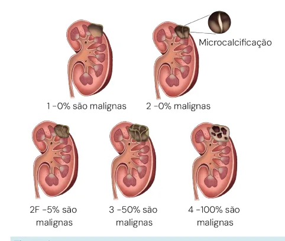
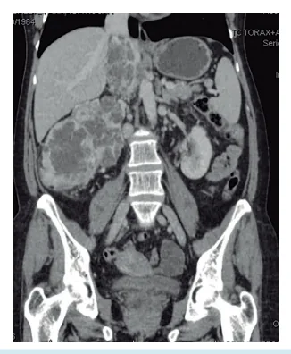
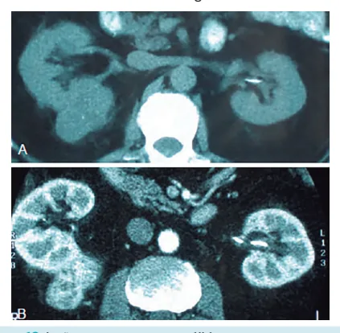
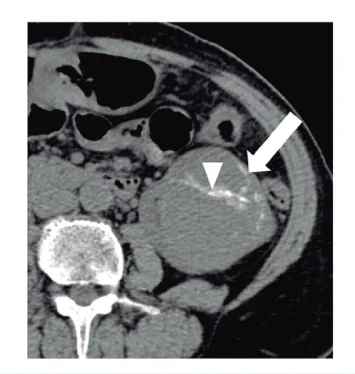
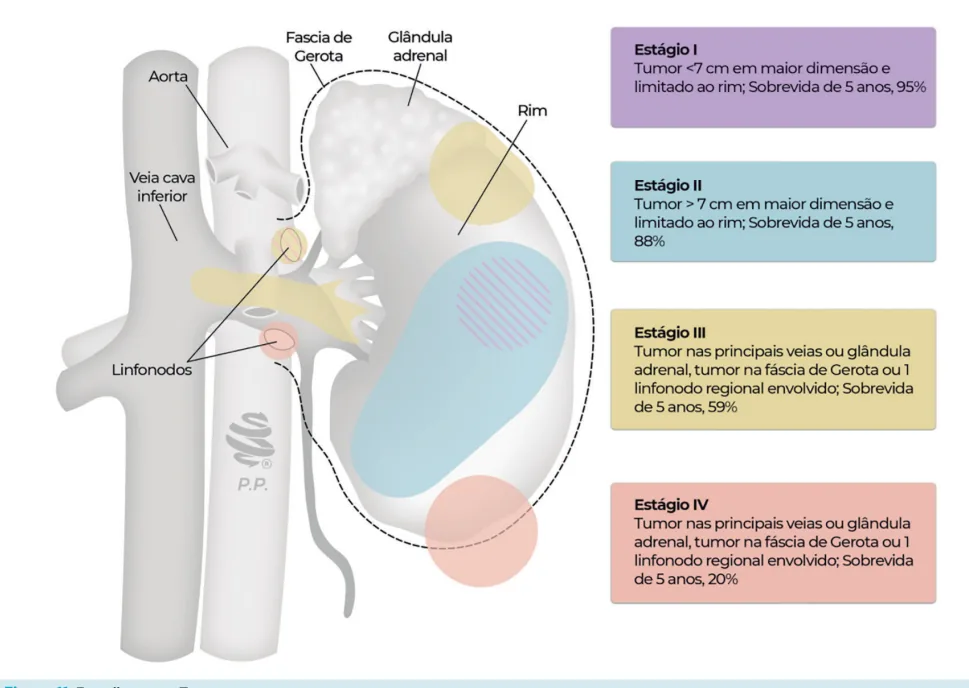
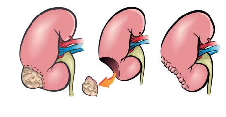
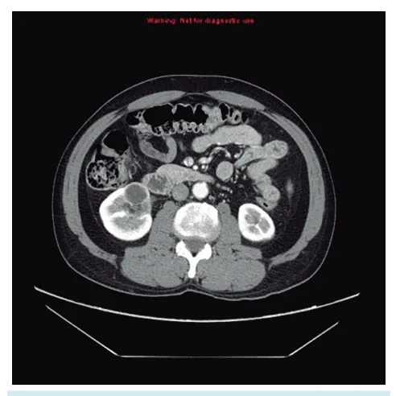
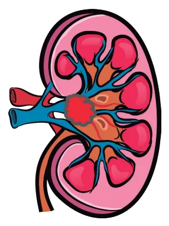

# Uro-oncologia: Rim

<!-- page:1 -->

## Uro-oncologia: Rim

**Tópicos**: Epidemiologia (tabagismo, HAS, obesidade, doença renal crônica (DRC), anemia falciforme); Histologia — células renais: Células Claras (CCR) (80%, pior prognóstico); Papilar (10-15%, DRC, multicêntrico, tipo 1 melhor e tipo 2 pior); Cromófobo (melhor prognóstico); Diferenciação Sarcomatoide (crescimento agressivo e metástases precoces); Outros Tumores: Carcinoma Medular; Sintomas e sinais (achado incidental; tríade — dor, hematúria, massa); Tumores Císticos (Bosniak): I – sem septo, sem massa, sem parede espessada, nada a fazer; II – septos finos, sem massa, nada a fazer; IIF – múltiplos septos finos, parede com realce mínimo, sem massa – seguimento; III – parede espessada ou irregular com realce, sem massas internas com realce – cirurgia; IV – tudo do III + presença de massa com realce – cirurgia; Estadiamento com TC/RM de abdome e pelve, imagem de tórax, TC crânio e cintilografia se necessário; Diferenciais: linfoma, metástase, tuberculose; Tratamento — Nefrectomia parcial: <7 cm boa localização; >7 cm e má localização ou trombo tumoral: nefrectomia radical; Vigilância ativa ou ablação tumoral: nódulos pequenos, paciente com baixo status de performance; Quimioterapia não funciona no CCR; imunoterapia como adjuvante em pacientes de alto risco (PD1 — pembrolizumabe); Seguimento — citorredução e metastasectomia são opções em pacientes de bom status performance e metástases localizadas.

## Definição

- É o câncer (CA) urológico mais letal (geralmente diagnosticado em estágio avançado);
- **Em primeiro lugar**, tumor de células claras (80% de incidência): pior prognóstico; circunscritos ao exame de imagem;
- **Em segundo lugar**, o carcinoma papilar (10 a 15% de incidência): multicêntrico; associado a paciente com DRC terminal (até dialítico); tipo 1 (mais comum e melhor prognóstico) e tipo 2 (mais agressivo e pior prognóstico);
- **Em terceiro lugar**, o tumor cromófobo (5% de incidência): bom prognóstico;
- O **carcinoma medular renal** é raro e acomete crianças/adultos jovens: é um tipo de CA altamente agressivo, sendo pouco responsivo às terapias; mortalidade próxima de 100% em poucos meses; relação do carcinoma medular renal com anemia falciforme.
- **Diferenciação sarcomatoide**: ao enviar para análise patológica, cerca de 5% dos carcinomas renais possuem grau de diferenciação sarcomatoide. Até 5% dos CCR; crescimento local agressivo; metástases precoces.

## Epidemiologia

- **Fatores de risco**: tabagismo; hipertensão arterial sistêmica; obesidade; pacientes renais crônicos (até mesmo paciente dialítico); anemia falciforme (em relação ao carcinoma medular renal);
- **CA de células claras**: homens, 50 a 70 anos;
- Cerca de 8% está relacionada com síndromes familiares: esclerose tuberosa; Birt-Hogg-Dubé;

---

<!-- page:2 -->

- **Von Hippel-Lindau**: mutação no gene VHL; gera maior incidência de carcinomas renais do tipo células claras (CCR células claras); feocromocitoma; hemangioblastomas; alterações de retina.

## Sinais e Sintomas

- Quando há sintomas, geralmente representa um quadro avançado/metastático;
- **Tríade clássica do tumor renal**: massa palpável; dor lombar; hematúria;
- Geralmente, diagnosticado por exame de imagem: tumor agressivo (massa) acometendo o rim direito; nódulo circunscrito com metade do tumor na forma exofítica; ambos os casos são assintomáticos.

*Figura 1: Neoplasia renal comprometendo todo o rim direito com espessamento de paredes.*

*Figura 2: Nódulo periférico em polo renal com realce de paredes.*

- Até 60% dos casos são diagnosticados de forma acidental por investigação de outro fator no exame de imagem;
- O USG levanta suspeita, porém a TC de Abdome e Pelve Contrastado é o padrão-ouro (maior precisão anatômica);

*Figura 3: Nódulo em polo renal visto à USG.*

- Apesar de ser tríade clássica (massa palpável, dor lombar, hematúria), ocorre em menos de 30% dos pacientes;
- Paciente também pode apresentar anemia nos exames laboratoriais.

## Síndromes Paraneoplásicas

- Hipertensão (HAS);
- Anemia;
- Episódios de febre não explicados;
- **Síndrome de Stauffer**: lesão hepática associada (principalmente canalicular).

## Exames Complementares

- **Tomografia (TC)**: padrão-ouro.

### Classificação de Bosniak

*Figura 4: Classificação de Bosniak para cistos renais.*

- Classificação tomográfica (expandida para ressonância) para classificar lesões císticas renais;
- **Bosniak 1**: benigno, que consiste em um cisto renal simples (lesão com paredes finas sem septações). Benigno, sem necessidade de seguimento com imagem.

*Figura 5: Cisto renal direito Bosniak 1.*

---

<!-- page:3 -->

- **Bosniak 2**: benigna, em que pode haver uma septação fina ou microcalcificações. Benigno, sem necessidade de seguimento com imagem.

*Figura 6: Cisto renal direito Bosniak 2. Observe a septação fina.*

- **Bosniak 2F**: tem 5% de chance de malignidade. É necessário acompanhar o paciente. Múltiplos septos, que podem ter alguma calcificação presente nos septos. Não tem realce com contraste. Seguimento do paciente com TC após 6 meses.

*Figura 7: TC após 6 meses.*

- **Bosniak 3**: realce parietal dos cistos e das septações. Tem chance de malignidade em cerca de 50%, sendo necessário intervenção cirúrgica. Principal diferença na TC para o Bosniak 2F: presença de realce de contraste na parede ou septo. Tratamento cirúrgico (nefrectomia).

*Figura 8: Cisto renal esquerdo Bosniak 3. Observe a contrastação de parede e septos.*

- **Bosniak 4**: lesão cístico-sólido, sendo considerada 100% maligna. Tratamento cirúrgico (nefrectomia).

*Figura 9: Cisto renal esquerdo Bosniak 4. Observe a presença de componentes sólido-císticos.*

## Lesão com Componente Sólido

- No próprio laudo, o radiologista sugere uma neoplasia renal: o diagnóstico definitivo se dá pelo anatomopatológico;
- Lesão com componente sólido, pobre em gordura (típico de CA de células renais), com ganho na contrastação de 20 UH ou mais: em caso de carcinoma renal de células claras, há um reforço de contrastação mais intenso, sendo heterogêneo. Em caso de carcinoma papilar, o reforço é mais discreto e a massa é homogênea.

*Figura 10: Lesão com componente sólido.*

- A ressonância tem importância em casos de: alergia à contraste iodado da TC; acometimento venoso pelo tumor (trombose venosa) — a RNM define o limite do trombo (inclusive invasão da veia cava); diferenciação entre Bosniak 2F e 3.

---

<!-- page:4 -->

## Diagnóstico e Estadiamento

- TC ou RM de abdome e pelve;
- Raio X de tórax → TC se raio X alterado ou alto risco para metástase no pulmão;
- Cintilografia óssea → se quadro de dor óssea ou fosfatase muito alterada;
- TC de crânio → se sintomas neurológicos.

*Figura 11: Estadiamento T.*

### T Bem Detalhado

*Verificar Figura 11.*

- **T1**: < 7 cm;
- **T2**: > 7 cm;
- **T3a**: tumor que tem um trombo tumoral ou invade até as veias renais, os seios e/ou gordura perirrenal (invasão de gordura peri-renal; invasão de gordura do seio renal);
- **T3b**: trombo tumoral que progride pela veia renal até chegar na veia cava infra-hepática;
- **T3c**: trombo tumoral que progride pela veia renal até chegar na veia cava supra-hepática;
- **T4**: tumor invade a fáscia de Gerota ou a adrenal ipsilateral. Se tiver invadido a contralateral, já é considerado um tumor M1 (metastático).

## Tratamento Cirúrgico

- **Nefrectomia parcial**, exceto se: invasão de gordura peri-renal; trombo tumoral.
- Nódulos menores (< 3 cm) têm crescimento lento: tratamentos menos invasivos; vigilância ativa;
- Os carcinomas de células renais são quimiorresistentes.

*Figura 12: Nefrectomia parcial de polo inferior de rim direito.*

*Figura 13: Nódulo periférico com possibilidade de exérese por nefrectomia parcial.*

---

<!-- page:5 -->

- **Nefrectomia radical**: T2 ou +, com ligadura do pedículo renal.

*Figura 14: Nefrectomia radical direita. Observe a ligadura do pedículo.*

*Figura 15: Nódulo central comprometendo a pelve renal, sendo indicada nefrectomia total para tratamento.*

- Invasão de cava (mesmo supra — T3c) e metástases não contraindicam cirurgia;
- **T1** (até 7 cm): se baixo perfil clínico, baixo status de performance ou tumores muito pequenos, pode-se realizar ablação ou vigilância ativa;
- **Situações especiais**:
  - Quando tem rim único → preservar parênquima ao máximo visando um desfecho oncológico positivo;
  - Von Hippel-Lindau → operar se > 3 cm e preservar parênquima; tumores < 3 cm é preferível manter vigilância ativa;
  - Trombo em veia cava → circulação extracorpórea (CEC) se necessário. Paciente com alto índice de morbimortalidade, podendo até precisar, no ato da cirurgia, de circulação extracorpórea se tiver um trombo. Caso contrário, deverá optar pela nefrectomia radical e encaminhar à diálise.

## Diagnósticos Diferenciais

- **Linfoma renal**: neoplasia hematológica; massa heterogênea; limites imprecisos;
- **Metástases no rim**: se o paciente tiver outro tumor primário ou se já tratou de outro tumor.

*Figura 16: Metástases acometendo rins + trombose de veia renal (seta).*

- **Tuberculose renal**: pode gerar massas renais que simulam uma neoplasia renal.

*Figura 17: Tuberculose renal em rim direito.*

- **Biópsia renal** antes da nefrectomia apenas em casos de exceção: quando se tem dúvida; também é aplicada quando se faz vigilância ativa ou terapias ablativas.

## Seguimento

**Doença metastática** (especialmente oligometastáticos):
- **Citorredução** tem benefício oncológico (mais sobrevida): associado a terapia alvo mostra um benefício oncológico ainda maior;
- **Metastasectomia**: também traz um benefício oncológico se tiver lesões metastáticas únicas ressecáveis.

---

<!-- page:6 -->

## Referências

Figura 1: Neoplasia renal comprometendo todo rim direito com espessamento de paredes. Reddan D et al. The American Journal of Medicine, 2001.

Figura 2: Nódulo periférico em polo renal com realce de paredes. Reddan D et al. The American Journal of Medicine, 2001.

Figura 3: Nódulo em polo renal visto à USG. Reddan D et al. The American Journal of Medicine, 2001.

Figura 4: Classificação de Bosniak para cistos renais. Gaillard F, Walizai T, Thibodeau R, et al. Bosniak classification system of renal cystic masses (version 2005). Reference article, Radiopaedia.org (Accessed on 12 Apr 2025) https://doi.org/10.53347/rID-1006

Figura 5: Cisto renal direito Bosniak 1. Cuete D, Renal cyst - Bosniak I. Case study, Radiopaedia.org (Accessed on 12 Apr 2025) https://doi.org/10.53347/rID-27479

Figura 6: Cisto renal direito Bosniak 2. Observe a septação fina. Gaillard F, Walizai T, Thibodeau R, et al. Bosniak classification system of renal cystic masses (version 2005). Reference article, Radiopaedia.org (Accessed on 12 Apr 2025) https://doi.org/10.53347/rID-1006

Figura 7: TC após 6 meses. Agnello F, Albano D, Micci G, Di Buono G, Agrusa A, Salvaggio G, Pardo S, Sparacia G, Bartolotta TV, Midiri M, Lagalla R, Galia M. CT and MR imaging of cystic renal lesions. Insights Imaging. 2020 Jan 3;11(1):5. doi: 10.1186/s13244-019-0826-3. PMID: 31900669; PMCID: PMC6942066.

Figura 8: Cisto renal esquerdo Bosniak 3. Observe a contrastação de parede e septos. Gaillard F, Walizai T, Thibodeau R, et al. Bosniak classification system of renal cystic masses (version 2005). Reference article, Radiopaedia.org (Accessed on 12 Apr 2025) https://doi.org/10.53347/rID-1006

Figura 9: Cisto renal esquerdo Bosniak 4. Observe a presença de componentes sólido-císticos. Gaillard F, Walizai T, Thibodeau R, et al. Bosniak classification system of renal cystic masses (version 2005). Reference article, Radiopaedia.org (Accessed on 12 Apr 2025) https://doi.org/10.53347/rID-1006

Figura 10: Lesão com componente sólido. Campbell and Walsh's Urology. 11th ed, 2016.

Figura 16: Metástases acometendo rins + trombose de veia renal na seta. Simplified Imaging Approach for Evaluation of the Solid Renal Mass in Adults by Ray Dyer, MD, David J. DiSantis, MD, Bruce L. McClennan, MD. Radiology: Volume 247: Number 2 - May 2008.

Figura 17: Tuberculose renal em rim direito. Al Salam H, Renal tuberculosis. Case study, Radiopaedia.org (Accessed on 12 Apr 2025) https://doi.org/10.53347/rID-17281
