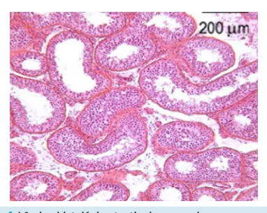
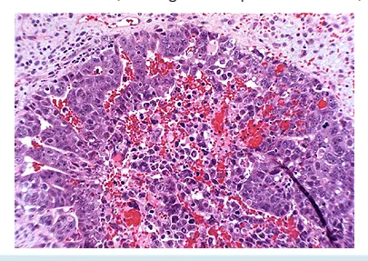
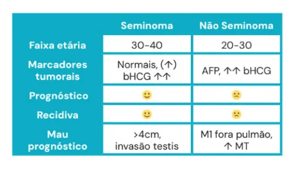
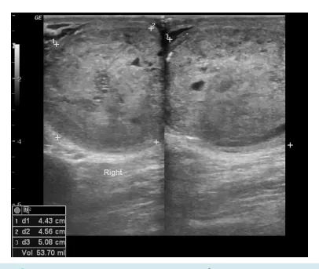
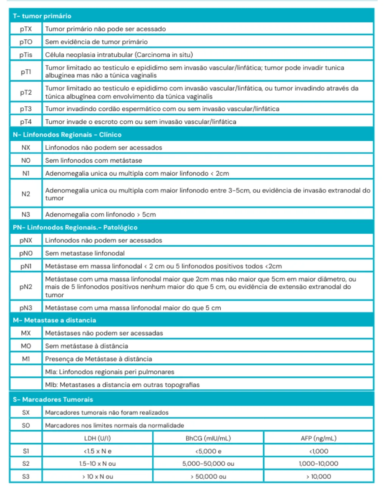
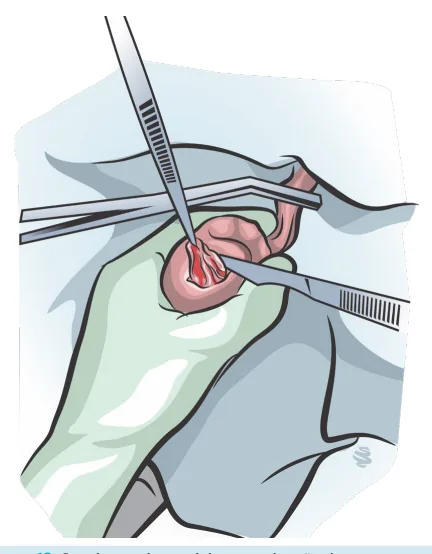
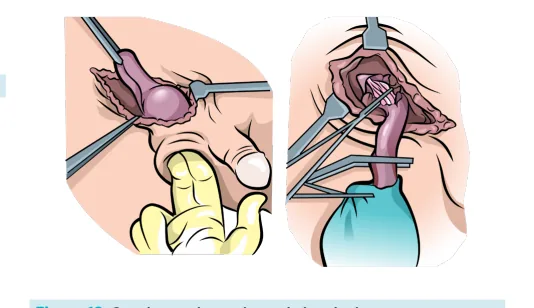

# Uro-oncologia: Testículos

<!-- page:1 -->

## Uro-oncologia: Testículos

**Tópicos**: Epidemiologia; Fatores de risco; Sintomas e sinais; Exames complementares; Estadiamento; Diferenciais; Tratamento; Seguimento.

**Resumo**: 95% germinativos, linfomas (idosos); criptorquidia, infertilidade; massa escrotal; USG de testículos + marcadores; TC de tórax/abdome/pelve (TAP), βHCG, DHL; alfafetoproteína (sobe apenas no não-seminoma); hidrocele — transluminescência; torção e orquite no PS (diagnósticos diferenciais de urgência); orquiectomia inguinal; enucleação em exceções; QT em estágios II e III. Doença residual: seminoma < 3 cm = expectante; não-seminomas > 1 cm = opera.

## Introdução

*Figura 1: Lâmina histológica testicular normal.*

- **Linfoma testicular** (5%) → relação com idosos;
- **Tumores germinativos do testículo** (95%) → relação com pacientes jovens:
  - **Seminoma**;

*Figura 2: Histologia de tumor testicular seminomatoso.*

- **Não-seminoma** (mais agressivo que o seminoma);

*Figura 3: Histologia testicular de tumor não-seminomatoso.*

*Figura 4: Incidência da neoplasia seminomatosa x não-seminomatosa de acordo com a faixa etária (taxa de incidência por milhão; eixo de idade: 0/4, 5/9, 10/14, 15/19, 20/24, 25/29, 30/34, 35/39, 40/64, 65+; seminomas mais comuns em faixas etárias mais jovens/intermediárias, não-seminomas mais agressivos e também predominando em jovens).*

---

<!-- page:2 -->

## Fatores de Risco

- Criptorquidia (10%);
- Infertilidade/atrofia testicular;
- Usuários de Cannabis;
- HIV+.

**Marcadores tumorais** → auxiliam no prognóstico e seguimento, mas não fazem diagnóstico:
- Aumento dos marcadores principalmente nos tumores não-seminomatosos.

## Sinais e Sintomas

- Massa escrotal;
- Indolor;
- Cresce rápido;
- Desconforto local;
- Relação aumentada com trauma – momento comum de identificação do aumento de volume.

## Exames Complementares

- Boa avaliação por USG.

*Figura 5: Seminoma — bem circunscrito e homogêneo.*

*Figura 6: Não-seminoma — mais irregular/heterogêneo, menos delimitado, regiões de necrose.*

*Figura 7: USG testicular normal.*

**Marcadores**:
- **βHCG** → aumento principalmente no coriocarcinoma; 10-15% dos seminomas têm aumento do βHCG;
- **Alfafetoproteína**: não se eleva nos quadros de seminoma → aumenta no CA embrionário e tumor de saco vitelínico;
- **DHL (ou LDH)** → relação com o volume tumoral.

Os níveis se relacionam com o volume tumoral, metástase e prognóstico.

*Tabela 1: Elevação dos marcadores tumorais com respectivas neoplasias testiculares.*

## Estadiamento

- Não se biopsia suspeita de tumor testicular, devido ao alto risco de implante no trajeto da biópsia;
- Diagnóstico final no anatomopatológico (AP) da orquiectomia.

*Tabela 2: Diferenciação entre neoplasia seminomatosa x não-seminomatosa de testículo.*

---

<!-- page:3 -->

*Tabela 3: Estadiamento TNM dos tumores testiculares.*

---

<!-- page:4 -->

- Destaca-se:
  - **Estádio I**: restrito ao testículo;
  - **Estádio II**: linfonodo (LFN) retroperitoneal;
  - **Estádio III**: metástase.

## Diagnósticos Diferenciais

- **Hidrocele**.

*Figura 8: Normal.*

*Figura 9: Hidrocele não comunicante.*

*Figura 10: Hidrocele comunicante.*

*Figura 11: Sinal da transluminescência positiva — sugere hidrocele.*

## Tratamento

- **Suspeita de tumor**: orquiectomia total via inguinal.

*Figura 12: Orquiectomia total por via inguinal.*

- **Orquiectomia parcial (enucleação)** — exceção: testículo único e desejo reprodutivo; testosterona normal; volume tumoral < 30% do volume testicular.

*Figura 13: Orquiectomia parcial ou enucleação do tumor.*

---

<!-- page:5 -->

## Seguimento

### Estádio I

- Acompanhar. Se alto risco, submete o paciente a 1 ciclo de quimioterapia com esquema **BEP** (Bleomicina, Etoposídeo e Platina);
- **Quando é alto risco?**
  - Seminoma: > 4 cm ou invasão de rete testis;
  - Não-seminoma: invasão vascular ou > 50% da composição do tumor é CA embrionário.

### Estádio II

- Quimioterapia com 4 ciclos BEP; avaliar se paciente é candidato à linfadenectomia retroperitoneal.
- **Quando realizar linfadenectomia**:
  - **Seminoma**: massa residual retroperitoneal < 3 cm = seguimento; massa residual retroperitoneal > 3 cm = realizar PET-FDG (positivo = linfadenectomia; negativo = seguimento);
  - **Não-seminoma**: massa residual retroperitoneal > 1 cm = cirurgia.

### Estádio III

- Quimioterapia com 4 ciclos BEP;
- Metastasectomia em casos selecionados;
- Excelente resposta à quimioterapia.

## Referências

Figura 1: Lâmina histológica testicular normal. Fonte: Histology Guide © Faculty of Biological Sciences, University of Leeds.

Figura 2: Histologia de tumor testicular seminomatoso. Fonte: http://thetcrc.org/pathology_report.html

Figura 3: Histologia testicular de tumor não-seminomatoso. Fonte: Uptodate.

Figura 4: Incidência da neoplasia seminomatosa x não-seminomatosa de acordo com a faixa etária. Fonte: Acervo Medcof.

Figura 5: Seminoma: bem circunscrito e homogêneo. Fonte: https://radiopaedia.org/cases/45719/studies/49912?lang=us

Figura 6: Não-seminoma: mais irregular/heterogêneo, menos delimitado, regiões de necrose. Fonte: https://radiopaedia.org/cases/testicular-non-seminomatous-germ-cell-tumour?lang=gb

Figura 7: USG testicular normal. Fonte: https://radiopaedia.org/images/626703?case_id=12525&lang=gb

Figura 8 a 10: Ilustrações - Acervo Medcof.

Figura 11: Sinal da transluminescência positiva — sugere hidrocele. Fonte: https://www.eumedicoresidente.com.br/post/exame-fisico-do-lactente-hidrocele-ou-hernia

Figura 12 e 13: Ilustrações - Acervo Medcof.
