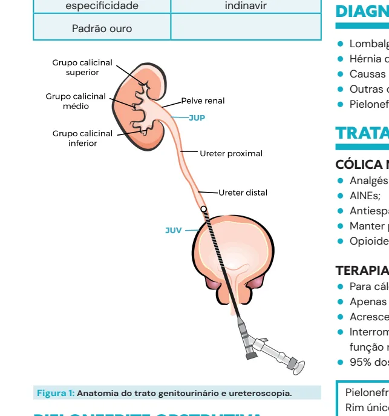
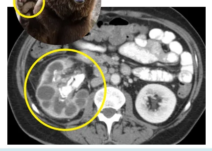
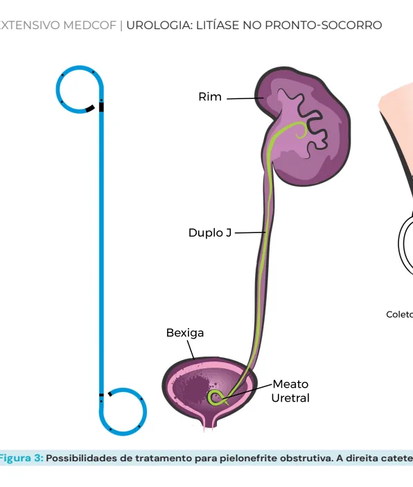
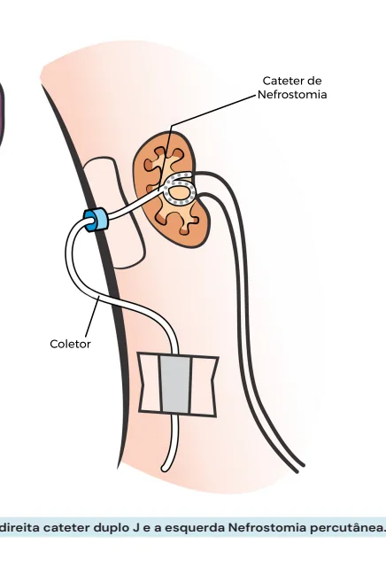

# Urologia Litíase no pronto-socorro

<!-- page:1 -->

## UROLOGIA: LITÍASE NO

## PRONTO-SOCORRO

Litíase (CIR) TC sem constraste é padrão ouro para diagnóstoco Ultrassom mais utilizado em crianças e gestantes evitar radiação da TC.

Tabela 1: Pontos principais sobre litíase renal do pronto socorr Definição Mi Epidemiologia 15% p Sintomas e sinais Ex complementares La Diagnóstico Pielonefrite Obstr Diferenciais Lombalgia mecâni Tratamento Sintomático Seguimento P

## DEFINIÇÃO

- Diagnóstico diferencial de dor lombar no PS

- Dor = migração dos cálculos renais para as vias urinárias

- 3 pontos de estreitamento : junção ureteropiélica uretrovesical (JUV).

(JUP), cruzamento dos vasos ilíacos, junção

- Verificar Figura 1 na próxima página

## EPIDEMIOLOGIA

- 15% da população geral

- Mais comum em homens → tendendo ao equilíbrio;

- Pico de incidência entre 40 e 60 anos

- Principal fator de risco é a baixa ingesta hídrica.

## SINAIS E SINTOMAS

- Podem ser assintomáticos,

- Migração do cálculo = dor.

- Dor (Cólica nefrética): Tipo cólica, súbita, de forte intensidade; Irradiação conforme sua localização no trato urinário; TERAPIA EXPULSIVA:

- Cálculos de até 5mm (ideal);

- Alfa bloqueador por até 4 a 6 semanas.

LITÍASE OBSTRUTIVA:

- Cateter duplo J

- Nefrostomia percutânea ro. Sintomas associados: inquietação, náuseas e vômitos, sudorese.

igração de cálculo na via urinária população, 40-60 anos, recorrente Dor, infecção e obstrução aboratoriais, cultura e tomografia rutiva - Clínica + achados em exame de imagem ica, pielonefrite não obstrutiva, prenhez ectópica os, terapia expulsiva, desobstrução se PNO Programar tratamento definitivo

- Sinais de obstrução: Dilatação da via urinária avaliada em exame de imagem; Anúria pode estar presente em rim único ou obstrução bilateral; Urinoma, obstrução aguda com distensão e rompimento da via urinária.

- Sinais de Infecção: Hematúria; Queda do estado geral; Instabilidade hemodinâmica, sinais de sepse.

## EXAMES COMPLEMENTARES

- Laboratorial – buscar por sinais de infecção Hemograma, provas inflamatórias, gasometria arterial, lactato, urocultura e hemocultura.

- Hemocultura; urocultura, urina 1

- Função renal e eletrólitos.

- B-HCG para mulheres em idade fértil;

- Exame de imagem: Tomografia computadorizada sem contraste = padrão ouro!

---

<!-- page:2 -->

Tabela 2: Comparação das vantagens e desvantagens entre Tomografia e Ultrassom para diagnóstico de cálculo renal.

## TOMOGRAFIA ULTRASSOM

Tamanho e número de Baixo Custo cálculos Topografia não é um Sem radiação limitante na TC Densidade do Cálculo Dificuldade em obesos Bom para Rim e terço Distância Pele-Cálculo proximal e distal de ureter Não examinador Examinador dependente dependente Preferir em crianças e Anatomia Renal gestantes

> 90% de sensibilidade e Preferir em cálculos de especificidade indinavir

Padrão ouro

- - - - T

- - - - T

- - - - Figura 1: Anatomia do trato genitourinário e ureteroscopia.

## PIELONEFRITE OBSTRUTIVA

- Clínica de infecção do trato urinário alto + sinais de obstrução em exame de imagem;

- Urocultura pode vir negativa nos exames iniciais. F

- Conduta: tratar o cálculo e a infecção n a

## PIELONEFRITE

## XANTOGRANULOMATOSA P

- Pielonefrite de repetição + cálculo + obstrução;

- Destruição do parênquima renal

(macrofagos xantomatosos)

- Sinal da pata do urso - dilatação calicinal

- Conduta: nefrectomia

- Figura 2: Sinal da pata do urso.

## DIAGNÓSTICO DIFERENCIAL

- Lombalgia mecânica;

- Hérnia discal;

- Causas obstétricas / ginecológicas;

- Outras causas de abdome inflamatório;

- Pielonefrite aguda.

## TRATAMENTO

## CÓLICA NEFRÉTICA

- Analgésico simples;

- AINEs;

- Antiespasmódico;

- Manter paciente normohidratado;

- Opioides de resgate.

## TERAPIA EXPULSIVA

- Para cálculos de até 5mm (podendo ser até 10mm)

- Apenas se não indicar cirurgia imediata;

- Acrescentar Alfa bloqueador por até 4 a 6 semanas;

- Interromper se dor refratária, infecção ou piora da função renal;

- 95% dos cálculos de até 4mm saem em 40 dias.

Rim único Imunossuprimido Obstrução bilateral Múltiplas comorbidades Ficar atento com os pacientes acima, geralmente necessitam de abordagem cirúrgica (não é possível aguardar o tempo de expulsão do cálculo).

- Desobstrução imediata: duplo J ou nefrostomia percutânea;

- Antibiótico;

- Hidratação;

- O2 se necessário;

- Monitorização se sepse;

---

<!-- page:3 -->

Figura 3: Possibilidades de tratamento para pielonefrite obstrutiv Cálculo < 10mm sem evidência de infecção:

podemos realizar terapia expulsiva Alfabloqueador (Tansulosina, doxazosina) AINE; Sintomáticos Falha de tratamento conservador Cálculos não passíveis de Tratamento conservador Figura 4: Fluxograma para condução de pacientes com ureterolit

## REFERÊNCIAS

Figura 2: Sinal da pata do urso. Fonte: Adaptado de https://institutoammo.org/noticia.php?n=75 va. A direita cateter duplo J e a esquerda Nefrostomia percutânea.

Evidência de pielonefrite obstrutiva Descompressão da Via urinária -> Cateter Duplo J -> Nefrostomia -> Antibioticoterapia e suporte Tratamento definitivo do cálculo -> Litotripsia extracorpórea (LECO)

-> Nefrolitotomia percutanea -> ULT Semirrígida -> Ureterolitotripsia flexível tíase não obstrutiva versus obstrutiva.

