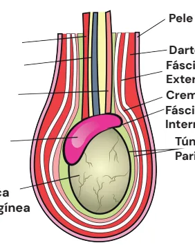
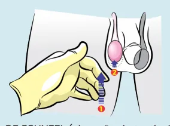
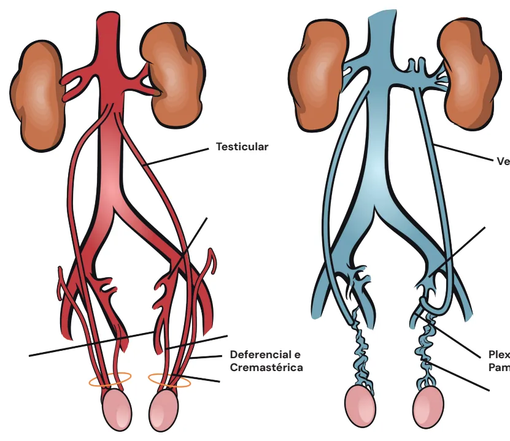
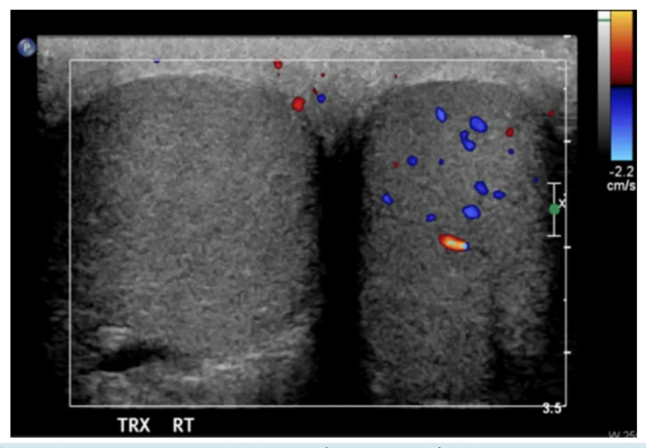
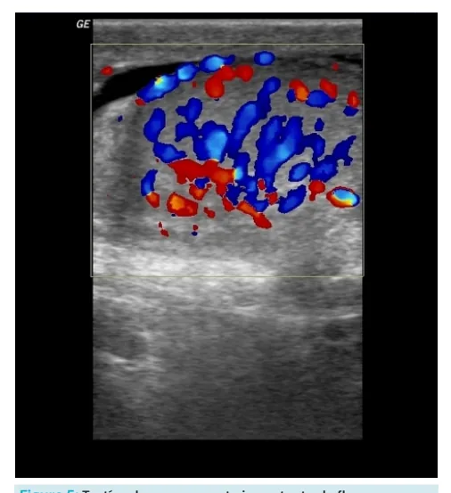
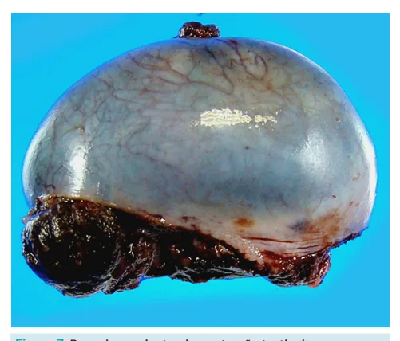
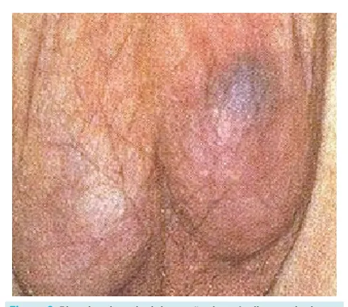

# Urologia PS - Escroto Agudo

<!-- page:1 -->

## Escroto Agudo

## TORÇÃO

- Início AGUDO;

- FORTE intensidade;

- Período NOTURNO;

- NÁUSEAS E VÔMITOS.

## ORQUIEPIDIDIMITE

- SUBAGUDO;

- LEVE A MODERADA;

- PROGRESSIVA;

- FEBRE.

## TORÇÃO TESTICULAR

- Reflexo cremastérico abolido.

USG DOPPLER DE TESTÍCULOS NÃO PODE ATRASAR CONDUTA CIRÚRGICA SE SUSPEITA DE TORÇÃO = CIRURGIA! Definição Do Epidemiologia Epid Torção - s Sintomas e sinais Epididimit Exames Complementares U Diagnóstico Diferenciais B Tratamento Seguimento

## DEFINIÇÃO

## CONCEITOS BÁSICOS

- Definição: Dor Escrotal Aguda no Pronto-Socorro;

- Entidades diagnósticas:

| Orquite / Epididimite; | Torção de apêndice; | Tumor testicular.

## ANATOMIA (CAMADAS EXTERNAS ÀS

## INTERNAS)

- Pele > Dartos > Fáscia Espermática externa > cremaster >> fáscia Espermática interna > túnica vaginal (parietal e visceral) > túnica albugínea.

- Tais camadas surgem a partir das camadas abdominais, durante a migração do tésticulo pelo canal inguinal até o escroto. Sinal de Brunzel Sinal de Angell

Bell Clapper

- ↑ SINAL DE BRUNZEL (elevação do testículo);

- → SINAL DE ANGELL (horizontalização do testículo).

or escrotal aguda no pronto socorro Torção - perinatal e puberdade didimite - criança jovem e pós pubere súbita, intensa, Angel, cremastérico ausente te - insidiosa, febre, vômitos, Prehn positivo USG doppler se não atrasar cirurgia Clínico + USG (se disponível)

Blue dot sign - torção de apêndice Torção - Exploração testicular Epididimite - antibioticoterapia Prótese, Infertilidade Pele Dartos Fáscia Espermática Externa Cremaster Fáscia Espermática Interna Túnica Vaginal Parietal e Visceral Túnica Albugínea Figura 1: Camada de externa a interna do testículo.

---

<!-- page:2 -->

Testicular Deferencial e Cremastérica Figura 2: Vascularização arterial e venosa do testículo. Tabela 1: Origem das fáscias e túnicas do escroto. O

- Fáscia de Scarpa Túnica dartos

- Oblíquo externo Fáscia espermática externa espermática média

Aponeurose do músculo Cremaster e fáscia Músculo Oblíquo interno Fascia transversalis Fáscia espermática média Peritônio parietal Túnica vaginal

## VASCULARIZAÇÃO

- Irrigação: artérias testiculares (origem direta da aorta), artéria deferencial e artéria cremastérica;

- Drenagem venosa: plexo pampiniforme e as veias T testiculares (a esquerda drena para a artéria renal esquerda, o que favorece varicocele do lado esquerdo;

enquanto isso, a veia testicular direita drena para a

- Veia Cava Inferior).

- Verificar Figura 2.

## EPIDEMIOLOGIA

- TORÇÃO

- 2 picos: Infância de 12 aos 15 anos;

- Mais comum é intravaginal;

- Quando extravaginal, pensar em torção testicular em

- RN ou pré-natal. Veia Testicular

Plexo Pampiniforme ORQUIEPIDIDIMITE

- Causa mais comum de dor escrotal;

- Ocorre em todas as faixas etárias: Criança: pensar em quadro infeccioso de etiologia Viral; Adulto jovem: pensar em DST (doença sexualmente transmissível); Idoso: pensar em ITU (infecção do trato urinário), principalmente se houver fatores de risco, como HPB.

## SINAIS E SINTOMAS

- Início agudo;

- Forte intensidade;

- Comum ocorrer no período noturno;

- Sintomas associados com possível relação com a dor:

náuseas e vômitos;

- Sinal de Brunzel: elevação do testículo torcido;

- Sinal de Angell: testículo torcido mais elevado e horizontalizado;

- Bell Clapper: implantação alta da túnica vaginal que se estende até a região do cordão, permitindo maior mobilidade do testículo e favorecendo sua rotação;

- Reflexo cremastérico abolido: reflexo cremastérico presente consiste em fazer um estímulo cutâneo no face interna da coxa, causando a elevação do testículo ipsilateral.

---

<!-- page:3 -->

Sinal de Brunzel Sinal de Angell Bell Clapper Figura 3: Reflexo cremastérico 1: Estímulo cutâneo. 2: Elevação do testículo ipsilateral. Sua ausência sugere torção testicular.

- Início Subagudo;

- Dor começa como leve a moderada e vai aumentando progressivamente;

- Febre; Figura 5: Testísculo com aumento importante do fluxo

- Sinal de Prehn positivo: alívio da dor durante elevação sanguíneo, compatível com orquite.

do testículo;

## DIAGNÓSTICO

| Sinal de epididimite.

## EXAMES COMPLEMENTARES

- Primordialmente clínico: USG apenas se não atrasar a conduta cirúrgica.

- USG Doppler de testículos (padrão-ouro):

- Diagnósticos Diferenciais:

- Não pode atrasar a conduta cirúrgica. Logo, se houver | Blue dot sign → sinal de torção de apêndice suspeita de torção, a indicação é cirúrgica. testicular, no qual a conduta pode ser expectante.

- Verificar Figura 4.

Figura 4: USG Doppler. Dois testículos avaliados, o testículo direito (à esquerda na imagem) sem fluxo e o esquerdo com fluxo preservado.

---

<!-- page:4 -->

- Se usuário sexualmente ativo: Cobrir Ceftriaxone 250mg IM dose única; Doxiciclina 100mg VO de 12/12h por 10 dias;

Neisseria e Chlamydia com:

- S

- R

Figura 6: Blue dot sign: sinal de torção de apêndice testicular.

## TRATAMENTO

## “TEMPO É TESTÍCULO” R

- 1º Passo - Escrototomia (se considerar colocar m prótese, preferir acesso com inguinotomia); 0

- 2º Passo - Abordar testículo torcido (distorcer, aquecer, conferir viabilidade);

- 3º Passo - Escolher entre orquidopexia (se viável) e B orquiectomia (se inviável) para o testículo torcido; (

- 4º Passo - Orquidopexia contralateral, independente da conduta para o testículo torcido. V d d Triar outras DSTs.

Figura 7: Peça de orquiectomia por torção testicular. | Doxiciclina 100mg VO de 12/12h por 10 dias;

- Se usuário Sexualmente inativo: Cobrir E. Quinolona VO 10 dias.

coli e Pseudomonas com:

## SEGUIMENTO

- Considerar colocação de prótese testicular;

- Discutir fertilidade.

## REFERÊNCIAS

Figura 4: USG Doppler. Dois testículos avaliados, o testículo direito (à esquerda da imagem) sem fluxo e o esquerdo com fluxo preservado.

Rosenberg, H., Long, B. & Keays, M. Just the facts: assessment and management of testicular torsion in the emergency department. Can J Emerg Med 23, 740–743 (2021). https://doi.org/10.1007/s43678-02100189-6 Figura 5: Testículo com aumento importante do fluxo sanguíneo, compatível com orquite.

Bickle I, Elfeky M, Jones J, et al. Orchitis. Reference article, Radiopaedia.org (Accessed on 02 Apr 2025) https://doi.org/10.53347/rID-21524 Figura 6: Blue dot sign: sinal de torção de apêndice testicular.

Vasdev, Nikhil et al. “The acute pediatric scrotum: presentation, differential diagnosis and management.” Current urology vol. 6,2 (2012): 57-61.

doi:10.1159/000343509 Figura 7: Peça de orquiectomia por torção testicular. Gaillard F, Le L, Walizai T, et al. Testicular torsion. Reference article, Radiopaedia.org (Accessed on 02 Apr 2025) https://doi.org/10.53347/rID10959

