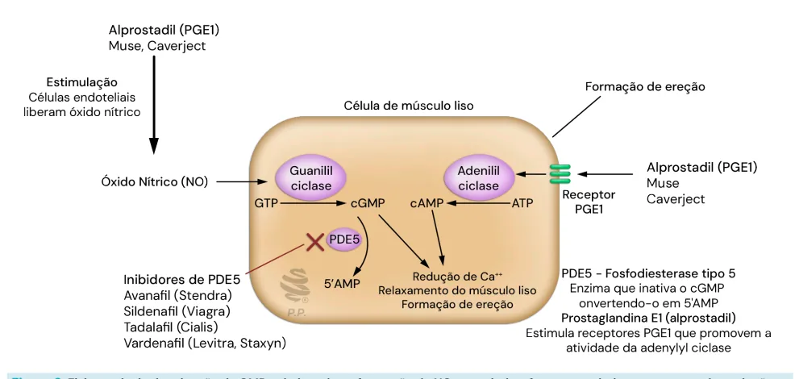
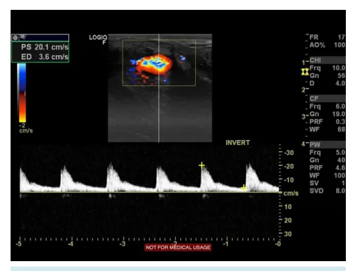
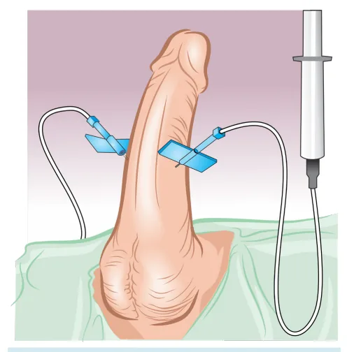
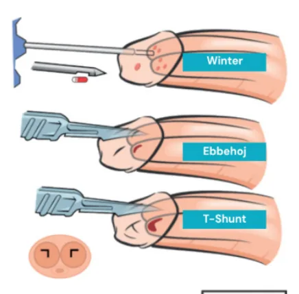

# Urologia PS — Priapismo

<!-- page:1 -->

Priapismo

## Características

### Isquêmico

- Extremamente **doloroso**.
- Ereção 10/10.
- Pode levar a isquemia.

### Não Isquêmico

- **Indolor**.
- Ereção pode ser "meia bomba".

## Avaliação

- Exame físico, gasometria de corpo cavernoso / USG Doppler.

**Tabela comparativa: Priapismo Isquêmico x Não Isquêmico**

> ⚠️ Tabela reconstruída a partir de OCR — confira contra a fonte original.

| Parâmetro | Isquêmico | Não Isquêmico |
|---|---|---|
| Aspecto | Escuro | Vermelho vivo |
| pO2 (mmHg) | < 30 | > 90 |
| pCO2 (mmHg) | > 60 | < 40 |
| pH | < 7,25 | > 7,35 |

## Definição

- Ereção não desejada que pode iniciar durante estímulo, mas perdura sem estímulo de forma prolongada (> 2-3 horas).
- Relembrando: o pênis no seu estado flácido apresenta a cavidade sinusoidal não preenchida e o músculo liso contraído; o pênis ereto apresenta o músculo liso relaxado, cavidades sinusoidais ingurgitadas, colapsando as veias e diminuindo o retorno venoso.

## Fisiologia da Ereção

- **Via do óxido nítrico**: ocorre liberação do óxido nítrico pelas células endoteliais, agindo de forma intracelular nas células musculares dos sinusoides, fazendo o estímulo da guanilil ciclase, que, por sua vez, converte guanosina trifosfato (GTP) em cGMP (monofosfato cíclico de guanosina). O cGMP é a substância ativa que irá promover o decréscimo de cálcio intracelular, levando ao relaxamento do músculo liso e ereção. Nessa mesma via, a fosfodiesterase degrada o cGMP; logo, sua inibição por medicamentos aumenta a concentração de cGMP e causa a ereção.

*Figura 1: Demonstração da musculatura peniana durante flacidez (à esquerda — músculo liso contraído, cavidade sinusoide colapsada, veia ingurgitada) e ereção (à direita — músculo liso relaxado, cavidade sinusoide ingurgitada, veia colapsada).*

### Via Receptores de Prostaglandinas (PGE)

- A ativação dos receptores de PGE1 leva à ação na adenilil ciclase, que converte adenosina trifosfato (ATP) em monofosfato cíclico de adenosina (cAMP), também levando ao decréscimo de cálcio, relaxamento do músculo liso e ereção.
- Medicações que agem diretamente nos receptores de PGE1.

### Medicações que Inibem a Fosfodiesterase (PDE5)

- Avanafil (Stendra®).
- Sildenafil (Viagra®).
- Tadalafil (Cialis®).
- Vardenafil (Levitra®, Staxyn®).

## Isquêmico (Baixo Fluxo)

- Envolve fenômenos venoclusivos.
- Fatores de risco: anemia falciforme ou uso de medicações (medicação intracavernosa para ereção ou cocaína).

## Não Isquêmico (Alto Fluxo)

- Envolve fístula arteriovenosa (sangue arterial entra nos corpos cavernosos, causando a ereção).
- Fator de risco: trauma perineal.
- Não configura urgência urológica, pois não causa isquemia.

## Sinais e Sintomas

### Isquêmico

- Extremamente doloroso.
- Ereção 10/10 (importante): pode levar a isquemia tecidual (urgente).

---

<!-- page:2 -->

*Figura 2: Fisiopatologia da ativação do GMP culminando na formação do NO, associado a fatores reguladores como sua degradação pela PDE5, com os respectivos fármacos que podem inibi-la, além da ativação através de receptores de prostaglandinas.*

### Não Isquêmico

- Geralmente indolor.
- Ereção pode ser "meia bomba" (o sangue não está totalmente represado).

## Exames Complementares

### Gasometria de Corpos Cavernosos

- Aspirado do sangue do corpo cavernoso:

> ⚠️ Tabela reconstruída a partir de OCR — confira contra a fonte original.

| Parâmetro | Isquêmico | Não Isquêmico |
|---|---|---|
| Aspecto | Escuro | Vermelho vivo |
| pO2 (mmHg) | < 30 | > 90 |
| pCO2 (mmHg) | > 60 | < 40 |
| pH | < 7,25 | > 7,35 |

*Figura 3: USG Doppler de um priapismo isquêmico (não há fluxo na artéria cavernosa).*

### USG Doppler de Pênis

- **Achados no priapismo isquêmico**: fluxo reduzido ou ausente na artéria cavernosa; índice de resistividade aumentado; sinais de trombose em corpo cavernoso ou esponjoso.
- **Achados no priapismo não isquêmico**: fístula arteriovenosa pode ser vista; velocidades normais ou aumentadas em artérias penianas.

*Figura 4: USG Doppler de um priapismo não isquêmico (observa-se fístula arteriovenosa).*

---

<!-- page:3 -->

## Priapismo — Abordagem Cirúrgica

- **Shunt distal**: produção de fístula entre o corpo cavernoso e esponjoso para drenagem do sangue represado.

> ⚠️ Fluxograma (Figura 5) reconstruído a partir de OCR — confira contra a fonte original.

*Figura 5: Fluxograma — condutas no priapismo no pronto-socorro até o diagnóstico (exame físico, gasometria de corpo cavernoso / USG Doppler).*

- **Não isquêmico**: observação clínica (resolução espontânea em 24-48h); embolização em casos refratários.
- **Isquêmico**: os passos são progressivos, iniciando pela irrigação/lavagem dos corpos cavernosos, injeção intracavernosa de solução de adrenalina/fenilefrina, e, se refratário, parte para condutas cirúrgicas — shunt distal e shunt proximal.

## Tratamento

- Punção com lavagem do corpo cavernoso (introduz soro fisiológico, podendo-se diluir alfa-adrenérgico).

*Figura 6: Irrigação e lavagem do corpo cavernoso.*

*Figura 7: Técnicas para confecção de shunt distal — procedimentos de Winter, Ebbehoj, T-Shunt e Al-Ghorab.*

*Figura 8: Técnicas para confecção de shunt proximal — técnicas de Quackels e Grayhack.*

---

<!-- page:4 -->

> ⚠️ Trecho e legenda da Figura 9 reconstruídos a partir de OCR — confira contra a fonte original.

*Figura 9: Dificuldade de confecção de próteses penianas após longo tempo de isquemia e fibrose (com confecção de shunt na artéria cavernosa) durante primeira cirurgia. Disfunção erétil → risco maior após 6h de isquemia → fibrose → dificuldade técnica para shunt/prótese.*

## Seguimento

- Importante se atentar para a disfunção erétil, principalmente quanto maior o tempo de isquemia (risco maior após 6 horas).
- A isquemia prolongada causa fibrose, inviabilizando o tecido do corpo cavernoso, somado à necessidade que muitos pacientes têm de realizar shunt, resultando em uma situação de maior dificuldade técnica para colocação da prótese.

## Referências

Figura 3: USG Doppler de um priapismo isquêmico (não há fluxo na artéria cavernosa). Morgan M, Silverstone L, Elfeky M, et al. *Priapism*. Reference article, Radiopaedia.org (Accessed on 02 Apr 2025) https://doi.org/10.53347/rID-32721

Figura 4: USG Doppler de um priapismo não isquêmico (observa-se fístula arteriovenosa). Morgan M, Silverstone L, Elfeky M, et al. *Priapism*. Reference article, Radiopaedia.org (Accessed on 02 Apr 2025) https://doi.org/10.53347/rID-32721
