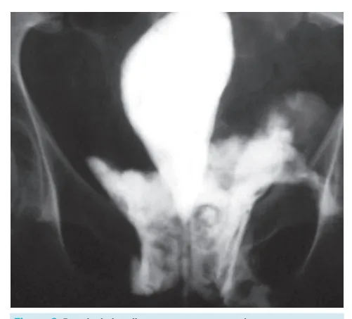
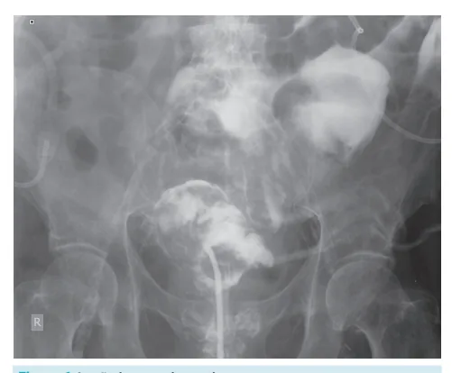

# Urologia PS - Trauma de Bexiga

<!-- page:1 -->

## Trauma de Bexiga

- 83-95% fratura pélvica associada;
- Hematúria macroscópica — 95% dos casos;
- Cistografia retrógrada.

> ⚠️ Tabela reconstruída a partir de OCR — confira contra a fonte original.

**Resumo do trauma de bexiga**

| Item | Descrição |
|---|---|
| Definição | Trauma automobilístico, fratura de pelve, bexiga cheia |
| Epidemiologia | 85% extraperitoneais, 15% lesão de uretra associada |
| Sintomas e sinais | Hematúria |
| Exames complementares | Cistografia retrógrada, cistotomografia |
| Tratamento | Extraperitoneal — SVD, com exceções; Intraperitoneal — cirurgia |

## Definição

- Órgão protegido no arcabouço ósseo (inerte a traumas de baixa intensidade);
- **Causas:**
  - Relação com traumas de alta intensidade: trauma automobilístico, fratura pélvica, trauma com bexiga cheia;
  - Relação com complicações iatrogênicas;
  - Ruptura em pacientes neuropatas.

## Epidemiologia

- 80-94% estão associadas a outras lesões;
- 83-95% possuem fratura pélvica associada;
- 5-10% presente nas fraturas pélvicas.

Figura 1: Lesão intraperitoneal.

- **Lesão extraperitoneal (85%)** é o mais comum, em que ocorre ruptura da bexiga para o espaço extraperitoneal;
- 15% das lesões de bexiga estão associadas à lesão uretral e 44% à lesão de outros órgãos.

## Sinais e Sintomas

- Hematúria macroscópica — presente em até 95% dos casos;
- Se resistência à sondagem, uretrorragia ou suspeita maior de lesão uretral = realizar UCRM (uretrocistografia retrógrada e miccional).

## Exames Complementares

### UCRM (Padrão-Ouro)

- Injeção de contraste intravesical; 350 ml → 3 imagens.
- **Padrões de lesão:**
  - Intraperitoneal: delineamento das alças;
  - Extraperitoneal: "chama de vela" ou "gota de lágrima".

Figura 2: Possível visualizar extravasamento de contraste (chama de vela) para o espaço extraperitoneal.

### Cistotomografia

- Injeção de contraste intravesical por via retrógrada;
- Utiliza-se o contraste diluído na proporção de 6:1.

---

<!-- page:2 -->

## Lesão Intraperitoneal

- **Cirurgia imediata:**
  - Rafia da bexiga em 2 planos com fio absorvível;
  - Drenagem da rafia pelo alto risco de fistulizar;
  - Antibioticoterapia.

Figura 3: Cistotomografia.

### Cistoscopia

- Se lesões intraoperatórias;
- Exemplo: sling retropúbico.

## Tratamento

### Lesão Extraperitoneal

- **Tratamento conservador:** paciente irá para o domicílio com SVD de 20 a 24 Fr, associado à antibioticoterapia;
- Repetir cistografia em 14 dias com o paciente ainda sondado para avaliar possibilidade de retirar a sonda.

**Indicações para abordagem cirúrgica:**

- Lesão de colo vesical;
- Fragmento ósseo entrando na bexiga;
- Lesão de reto associada;
- Se realizar laparotomia exploradora por algum outro motivo.

**Pós-operatório:**

- Antibioticoterapia;
- SVD por 7 a 10 dias e repetir a cistografia antes de retirar a sonda, para garantir ausência de vazamento.

## Seguimento

**Possíveis complicações:**

- Sepse;
- Fístulas;
- Lesões neurológicas.

## Referências

Figura 1: Lesão intraperitoneal. Radswiki T, Le L, Walizai T, et al. Urinary bladder trauma. Reference article, Radiopaedia.org (Accessed on 02 Apr 2025) https://doi.org/10.53347/rID-12756

Figura 2: Possível visualizar extravasamento de contraste (chama de vela) para o espaço extraperitoneal. Gänsslen, A., Grechenig, S. (2021). Urological Trauma. In: Gänsslen, A., Lindahl, J., Grechenig, S., Füchtmeier, B. (eds) Pelvic Ring Fractures. Springer, Cham. https://doi.org/10.1007/978-3-030-54730-1_21

Figura 3: Cistotomografia. Sheldon J, Intraperitoneal bladder rupture. Case study, Radiopaedia.org (Accessed on 02 Apr 2025) https://doi.org/10.53347/rID-26049
