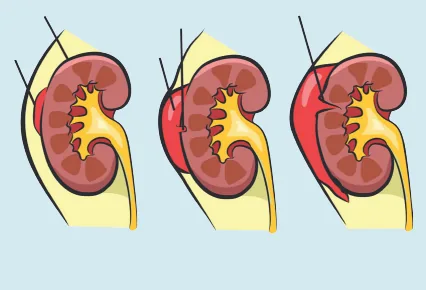
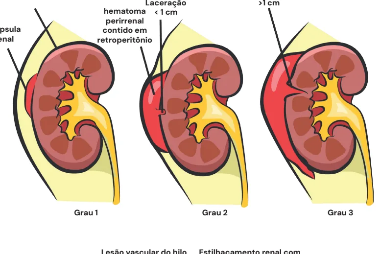
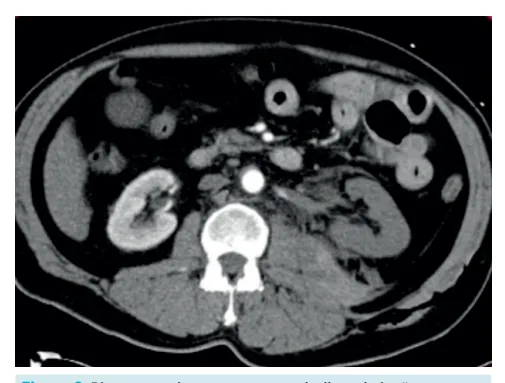
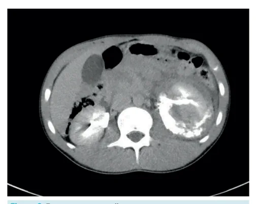
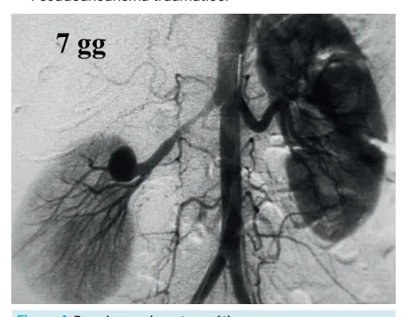
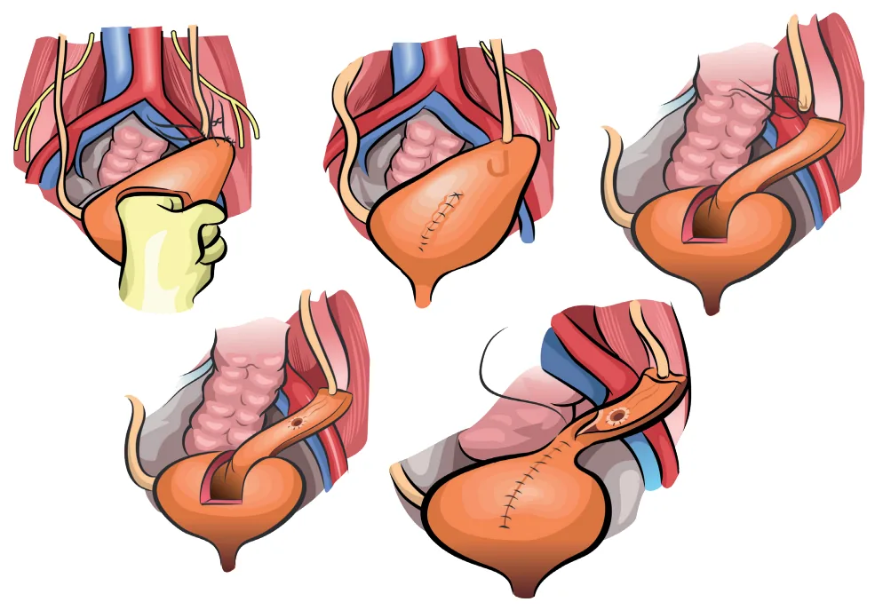
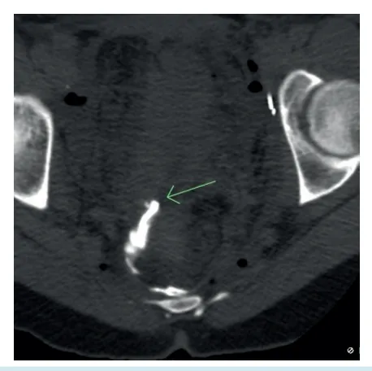

# Urologia PS - Trauma de Rim e de Ureter

<!-- page:1 -->

## Trauma Renal e de Ureter

- **Estável = observação;**
- **Embolização** — falha do tratamento clínico; queda de hemoglobina (Hb);
- **Cirurgia** — instabilidade hemodinâmica mantida; lesões grau 5 (trombose arterial ou ferimentos penetrantes); hematoma perirrenal pulsátil ou em expansão;
- **Angioembolização** — sangramento renal ativo → blush na tomografia computadorizada (TC); fístula arteriovenosa; pseudoaneurisma traumático;
- **Urinoma** — antibioticoterapia; reavaliar com TC em 7 dias; se infecção ou manter achado → duplo J / nefrostomia.

> ⚠️ Tabela reconstruída a partir de OCR — confira contra a fonte original.

**Resumo do trauma renal e de ureter**

| Item | Descrição |
|---|---|
| Definição | Classificação em graus I a V: I. subcapsular; II. laceração < 1 cm; III. laceração > 1 cm; IV. atinge sistema coletor; V. estilhaçamento (shattering), avulsão |
| Epidemiologia | 5% dos traumas, mecanismo de desaceleração |
| Sintomas e sinais | Hematúria |
| Exames complementares | Estável — TC com contraste e fase excretora |
| Tratamento | Estável — observação, embolizar se blush; Instável — cirurgia (grau V, penetrantes, hematomas pulsáteis) |
| Seguimento | Urinoma — ATB, duplo J se não melhorar |

## Trauma Renal

- Grau 5: estilhaçamento renal com parênquima fragmentado ou avulsão completa do hilo renal.

## Classificação (Associação Americana de Cirurgia do Trauma)

- **Grau 1:** hematoma subcapsular ou hematúria macroscópica não justificada por outra causa;
- **Grau 2:** hematoma perirrenal contido em retroperitônio (não está em expansão) e laceração < 1 cm;
- **Grau 3:** laceração > 1 cm, que não chega ao sistema coletor;
- **Grau 4:** lesão que atinge o sistema coletor e/ou lesão vascular do hilo renal contida e/ou trombose de artéria renal;
- **Grau 5:** estilhaçamento renal com parênquima fragmentado ou avulsão completa do hilo renal.

Verificar Figura 1 na próxima página.

## Epidemiologia

- 5% dos casos de trauma;
- Mais comum em homens jovens;
- Principal mecanismo envolvido no trauma renal: desaceleração com grande impacto.

---

<!-- page:2 -->

Figura 1: Ilustrações superiores: trauma renal grau 1, grau 2 e grau 3, da esquerda para a direita (hematoma subcapsular; laceração < 1 cm com hematoma perirrenal contido em retroperitônio; laceração > 1 cm da cápsula renal). Ilustrações inferiores: trauma renal grau 4 e grau 5, da esquerda para a direita (lesão que atinge o sistema coletor e/ou lesão vascular do hilo renal contida e/ou trombose de artéria renal; estilhaçamento renal com parênquima fragmentado e avulsão completa do hilo renal).

## Sinais e Sintomas

- **Estigmas de trauma:** hematoma lombar; fratura de costela; escoriações próximas à região lombar;
- Desconfiar de trauma renal sempre que houver hematúria: no entanto, no Grau IV, 7% dos pacientes não apresentam; nem todo trauma renal cursa com hematúria — no trauma vascular, até 36% não tem;
- Procurar sinais de instabilidade hemodinâmica.

## Exames Complementares

- Tomografia computadorizada de abdome total com contraste intravenoso (padrão-ouro);
- Importante avaliar a fase excretora tardia, na qual pode ser flagrado extravasamento de contraste.

Figura 2: Rim esquerdo sem contraste, indicando lesão da artéria renal.

Confira a Figura 2 e a Figura 3.

---

<!-- page:3 -->

## Indicações de Angioembolização

- Sangramento renal ativo: encontrado no exame de imagem como blush (extravasamento de contraste por algum vaso) na TC;
- Fístula arteriovenosa;
- Pseudoaneurisma traumático.

Figura 3: Fase excretora tardia com extravasamento de contraste.

## Tratamento

### Paciente Estável

- Prefere-se a observação ativa (paciente internado e avaliação contínua);
- As indicações para realizar embolização são diante da falha do tratamento clínico (instabilidade) e/ou queda seriada da Hb.

### Indicações Absolutas de Cirurgia

- Instabilidade hemodinâmica mantida;
- Lesões grau 5, trombose arterial ou ferimentos penetrantes;
- Hematoma perirrenal pulsátil ou em expansão;
- Geralmente resulta em nefrectomia.

Verificar Tabela 1.

> ⚠️ Tabela reconstruída a partir de OCR — confira contra a fonte original.

**Tabela 1: Graus de recomendação da Guideline da Sociedade Europeia de Urologia**

| Conduta | Grau de recomendação |
|---|---|
| Gerenciar pacientes estáveis com trauma renal contuso sem cirurgia, com monitoramento rigoroso e nova imagem conforme necessário | Forte |
| Gerenciar lesões isoladas de grau 1-4 e ferimentos por arma de fogo de baixa velocidade em pacientes estáveis sem cirurgia | Forte |
| Usar angioembolização seletiva para sangramento renal ativo se não houver outras indicações para exploração cirúrgica imediata | Forte |
| Proceder à exploração renal na presença de: instabilidade hemodinâmica persistente; lesão vascular penetrante grau 5; hematoma perirrenal expansivo ou pulsátil | Forte |

Figura 4: Pseudoaneurisma traumático.

## Seguimento

- Ficar atento à formação de urinoma (coleção de urina);
- Nesses casos, a conduta é antibioticoterapia e reavaliar com TC em 7 dias; se infecção ou manter achado, está indicada a drenagem, passando um duplo J e/ou realizando nefrostomia.

## Trauma de Ureter

- **Definição:** incomum em traumas por ser um órgão móvel; a causa mais comum é a iatrogênica durante cirurgias.

### Epidemiologia

- 80% dos casos: iatrogênica — 54% histerectomias; 14% colectomias; 8% ooforectomias;
- 1-2,5% dos traumas urinários, especialmente penetrantes (incomum no trauma contuso);
- TC de abdome e pelve com contraste e fase excretora tardia (20 min);
- Pielografia ascendente se a lesão ocorrer no intraoperatório.

Verificar Figura 5 na próxima página.

### Paciente Instável

- Fazer passagem do duplo J ou nefrostomia;
- Esse paciente pode evoluir com estenose, e sua reconstrução pode ser realizada posteriormente quando o paciente estiver estável.

---

<!-- page:4 -->

- Procede-se com o reparo imediato;
- Se lesão parcial do ureter, pode-se passar o duplo J ou realizar rafia primária;
- Se lesão proximal do ureter (acima do cruzamento dos vasos ilíacos), tende-se a preferir uma uretero-ureteroanastomose ou uretero-calicoanastomose ou transuretero-anastomose, pois é uma região de menor tensão em que o ureter é mais móvel;
- Se lesão do ureter distal, esta região está sujeita a uma tensão maior; por isso, prefere-se um reimplante ureteral, podendo-se realizar pela técnica de Politano-Leadbetter, Psoas hitch ou Boari flap.

Verificar Figura 6.

Verificar Figura 7 na próxima página.

Figura 5: Extravasamento de contraste no ureter em TC de abdome e pelve com contraste e fase excretora tardia (20 min).

Figura 6: Ilustração do Boari flap.

---

<!-- page:5 -->

Figura 7: Fluxograma do manejo do paciente com trauma de ureter — estável: reparo imediato; se lesão proximal: uretero-ureteroanastomose, uretero-calicoanastomose ou transuretero-anastomose; se lesão parcial: duplo J ou rafia primária; se lesão distal: mais tensão → reimplante (Politano-Leadbetter, Psoas hitch, Boari flap). Instável: nefrostomia → possível estenose → reconstrução posterior.

## Referências

Figura 2: Rim esquerdo sem contraste, indicando lesão da artéria renal. Singh G, Renal vascular pedicle injury. Case study, Radiopaedia.org (Accessed on 02 Apr 2025) https://doi.org/10.53347/rID-36191

Figura 3: Fase excretora tardia com extravasamento de contraste. Turi B, O'Shea P, Hacking C, et al. Renal trauma. Reference article, Radiopaedia.org (Accessed on 02 Apr 2025) https://doi.org/10.53347/rID24681

Figura 4: Pseudoaneurisma traumático. Turi B, O'Shea P, Hacking C, et al. Renal trauma. Reference article, Radiopaedia.org (Accessed on 02 Apr 2025) https://doi.org/10.53347/rID24681

Figura 5: Extravasamento de contraste no ureter em TC de abdome e pelve com contraste e fase excretora tardia (20 min). Ebouda F, Ranchod A, Bickle I, et al. Ureteric injury. Reference article, Radiopaedia.org (Accessed on 02 Apr 2025) https://doi.org/10.53347/rID29535
