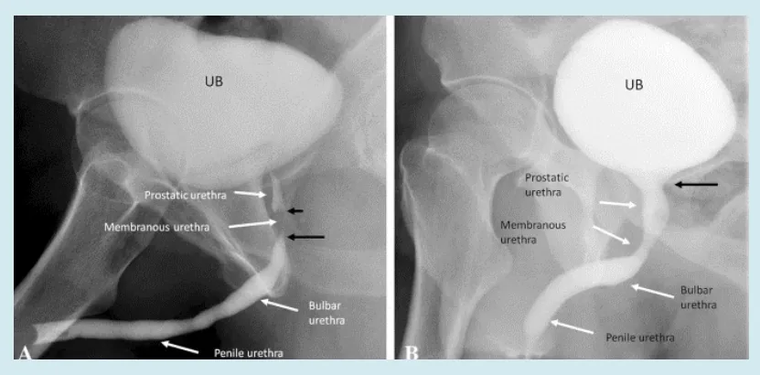
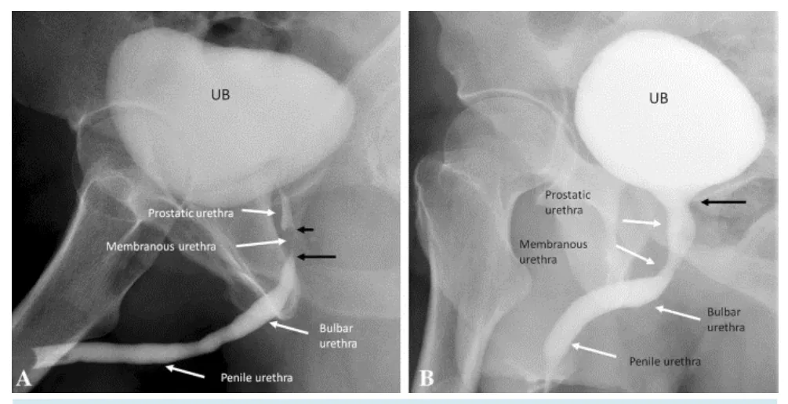
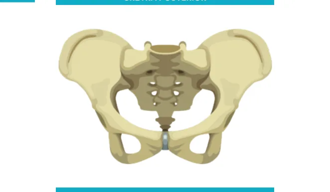
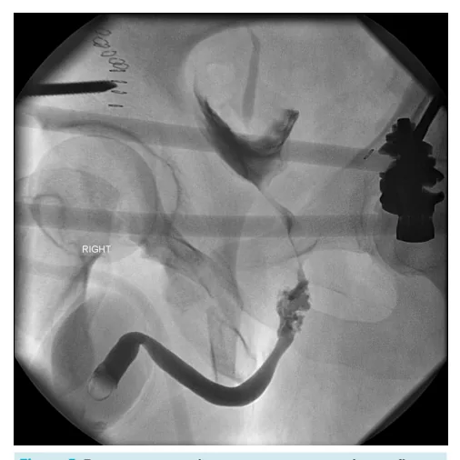
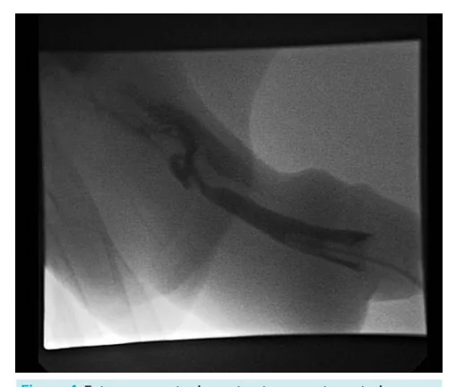

# Urologia PS - Trauma de Uretra e Estenose de Uretra

<!-- page:1 -->

## UROLOGIA: PS - TRAUMA DE URETRA

## E ESTENOSE DE URETRA

Trauma de uretra Definição Epidemiologia Sinais e sintomas Exames complementares Con Tratamento Seguimento Bulb Pos

## TIPOS

Uretra Posterior

- Quase exclusivas de fratura (fx) de pelve

- 1 a 10% das fraturas

- Fratura do anel anterior ou diástase púbica ntuso: cistostomia/realinhamento endoscópico bar: UI (< 1cm), T-T (< 2,5 cm), enxerto mucosa sterior: anastomótica +- Manobras de Webster

URETROCISTOGRAFIA RETRÓGRADA (A) E MICCIO Uretrocist Uretr Contuso Cistostomia /realinhamento endoscóp Reavaliação para tratamento definitiv Anterior: peniana + bulbar Posterior: prostática + membrana Anterior: queda a cavaleiro Posterior: fratura de pelve Uretrorragia, retenção, hematoma UCRM - local e se lesão completa Penetrante: reparo primário Meato: meatotomia Peniana: técnicas substitutivas Uretra Anterior

- Trauma urogenital

- Queda a cavaleiro

- Sondagem Vesical tografia retrógrada rocistoscopia pico Reparo primário vo

ONAL (B) Penetrante ou fratura peniana

---

<!-- page:2 -->

## TRAUMA DE URETRA

## URETRA POSTERIOR

## ANATOMIA DA URETRA

- Uretra posterior: prostática e membranosa;

- Uretra anterior: bulbar e peniana.

- Uretra anterior: bulbar e peniana.

## POSTERIOR PROSTÁTICA MEMBRANOSA BULBAR PENIANA ANTERIOR

- Figura 1: Topografia e divisões da uretra.

## CLASSIFICAÇÃO DO TRAUMA DE URETRA

- Posterior: quase exclusiva de fratura da pelve, E ocorrendo em 1-10% das fraturas de pelve;

- A fratura do anel anterior ou diástase púbica são os principais achados diante de fratura associada a lesão de uretra posterior;

- Anterior: relação com trauma urogenital, principalmente a queda a cavaleiro. Porém, a causa mais comum é iatrogênica, em casos de sondagem vesical.

Figura 3: Uretrocistografia miccional com melhora da estenose apres Quase exclusivas de fx pelve 1 a 10% das fx Fx anel anterior ou diástase púbica Figura 2: Fratura pélvica com trauma de uretra.

## SINAIS E SINTOMAS

- Uretrorragia (principal sintoma);

- Próstata não tocável;

- Hematoma perineal;

- Retenção urinária.

## EXAMES COMPLEMENTARES

- Uretrocistografia retrógrada e miccional Fase retrógrada: avaliação por múltiplas imagens enquanto se injeta contraste retrogradamente, preenchendo toda a uretra até a bexiga; Fase miccional: ocorre maior abertura do colo vesical, preenchendo melhor a uretra prostática. Figura 3 sentada em fase miccional.

(padrão-ouro);

---

<!-- page:3 -->

- Lesão completa de uretra anterior (vazamento do

- Causas inflamatórias: Balanite Xerótica Obliterante: doença crônica de causa mal definida, interrogando-se causas autoimunes ou pós-infecção viral, causando uretrocistografia miccional.

contraste na uretra anterior): Figura 4 | Pós-uretrites (ex: Gonocócica); Figura 4: Extravasamento de contraste em uretra anterior em

- Lesão parcial de uretra posterior (há extravasamento, porém parte do contraste chega à bexiga): Figura 5 miccional.

Figura 5: Extravasamento de contraste em uretrocistografia

## TRATAMENTO

- Trauma contuso: realiza-se cistostomia / realinhamento endoscópico, e, após, reavaliar para tratamento definitivo;

- Trauma penetrante ou fratura peniana: realiza-se reparo primário da uretra.

## ESTENOSE DE URETRA

- Causas traumáticas: Iatrogênica, como sondagem ou instrumentação cirúrgica; Traumatismo da uretra. autoimunes ou pós-infecção viral, causando estenose e fechamento do meato uretra e alterações na glande, com aderências.

Uretrocistografia retrógrada Uretrocistoscopia Contuso Penetrante ou fratura peniana Cistostomia /realinhamento endoscópico Reparo primário Reavaliação para tratamento definitivo Figura 6: Fluxograma do manejo do trauma de uretra.

Figura 7: Balanite Xerótica Obliterante.

## MEATO URETRAL E FOSSA NAVICULAR

- Meatotomia / Meatoplastia;

- Retalhos de pele podem ser necessários;

- Enxerto de mucosa oral é uma opção na Balanite

Xerótica Obliterante. URETRA PENIANA

- Uretroplastia substitutiva, no qual há importante papel do enxerto de mucosa oral;

- Dilatação uretral;

- Uretrotomia interna (anelar): mais aplicável para a uretra bulbar;

- Uretroplastia anastomótica NÃO é indicada → causa encurtamento.

## URETRA BULBAR

- Uretroplastia Anastomótica T-T: indicada para estenoses curtas, < 2,5 cm;

- Uretrotomia Interna: indicada para estenoses ainda menores, < 1 cm;

- Opção: Uretroplastia com enxerto.

- Uretroplastia Anastomótica com ou sem enxerto;

---

<!-- page:4 -->

- Se houver dificuldade na conexão da anastomose, Figura 4: Extravasamento de contraste em uretra anterior em pode-se lançar mão das Manobras de Webster: uretrocistografia miccional. 1- Liberação da uretra até ligamento suspensor Radswiki T, Urethral rupture. Case study, Radiopaedia.org (Accessed on 02 do pênis; Apr 2025) https://doi.org/10.53347/rID-12058 2- Abertura dos corpos cavernosos; 2- Abertura dos corpos cavernosos; 3- Pubectomia inferior; 4- Transposição dos corpos cavernosos.

REFERÊNCIAS o Figura 1: Cofexpress. D Ramanathan, S., Raghu, V. & Ramchandani, P. Imaging of the adult male urethra, penile prostheses and artificial urinary sphincters. Abdom Radiol 45, 2018–2035 (2020). https://doi.org/10.1007/s00261-019-02356-x Figura 3: Uretrocistografia miccional com melhora da estenose apresentada em fase miccional.

Ramanathan, S., Raghu, V. & Ramchandani, P. Imaging of the adult male urethra, penile prostheses and artificial urinary sphincters. Abdom Radiol 45, 2018–2035 (2020). https://doi.org/10.1007/s00261-019-02356-x Figura 5: Extravasamento de contraste em uretrocistografia miccional.

Dixon A, Traumatic urethral injury. Case study, Radiopaedia.org (Accessed on 02 Apr 2025) https://doi.org/10.53347/rID-31648 Figura 7: Balanite Xerótica Obliterante.

Depasquale, I et al. “The treatment of balanitis xerotica obliterans.” BJU international vol. 86,4 (2000): 459-65. doi:10.1046/j.1464410x.2000.00772.x
