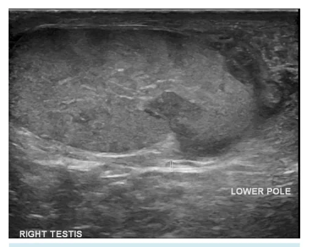

# Urologia PS - Trauma Genital Extensivo

<!-- page:1 -->

## Trauma Genital

> ⚠️ Tabela reconstruída a partir de OCR — confira contra a fonte original.

**Tabela 1: Principais tipos de trauma genital**

| Tipo | Conduta |
|---|---|
| Deslocamento testicular | Reposicionamento manual ou orquidopexia imediata |
| Hematocele | < 3x volume testicular: conservador; > 3x: cirurgia |
| Ruptura | Cirurgia → evitar orquiectomia; remover coágulos, ressecar túbulos inviáveis, fechar albugínea |

## Epidemiologia

- Presentes em até 2/3 dos traumas urológicos;
- **Trauma peniano:** fratura peniana e outros traumas (ferimento por arma de fogo, mordedura por animal, amputação, lesão por zíper);
- **Trauma testicular:** 75% (trauma contuso), contusão, hematoma, deslocamento, torção, ruptura.

## Ruptura Testicular

- Perda de continuidade da túnica albugínea;
- Exame clínico é suficiente; ultrassonografia (USG) ou ressonância magnética (RM) podem ser utilizados;
- **Conduta:** cirurgia (via escrotal) / avaliar debridamento de tecidos inviáveis.

Figura 1: Ruptura testicular de testículo direito. Observe o defeito na túnica albugínea, na porção inferior da imagem.

## Hematocele

- Acúmulo de sangue entre as camadas parietal e visceral da túnica;
- Podem estar associados a ruptura;
- **Conduta:** cirurgia se hematoma de grande volume (> 3 vezes o volume testicular) ou sinais de síndrome compartimental.

## Deslocamento Testicular

- Testículo fora de posição habitual;
- Externo ou interno;
- **Conduta:** reposicionamento manual ou cirurgia.

## Referências

Figura 1: Ruptura testicular de testículo direito. Observe o defeito na túnica albugínea, na porção inferior da imagem. Chen T, Sattar A, Hernández Esturban D, et al. Testicular trauma. Reference article, Radiopaedia.org (Accessed on 02 Apr 2025) https://doi.org/10.53347/rID-30587

