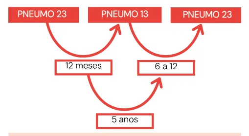

# Vacinação do Idoso

<!-- page:1 -->

Vacinas e precauções (CM) Vacinas Indicação Influenza Rotina (>60a) Pneumocócica (PCV13, PCV15 e Rotina (>60a)

PCV20 e VPP23) PC Herpes zóster (Shingrix - inativada Rotina (> 50a) Zostavax - atenuada) Tríplice bacteriana Rotina dT Não vacinados Hepatite B previamente Não vacinados Febre Amarela previamente Rotina Vírus Sincicial (>70a e >60a com ( Respiratório fatores de risco)

Variável - checar COVID aula específica INFLUENZA

- Deve ser aplicada de rotina.

- Dose: única, anual.

- Indicada a pessoas maiores de 60 anos; Motivo: risco aumentado de formas graves e óbito por influenza após os 60 anos.

- Esquemas: 4V fornece maior cobertura que 3V; 4V – clínicas privadas; 3V – SUS.

- Em situações epidemiológicas de risco, é possível considerar uma segunda aplicação 3 meses após a aplicação da dose anual de rotina. Esquemas Disponibilidade

Única anual SUS Ideal

## PCV 13 - VPP 23 - VPP 23 SUS

Alternativo PCV 13 (CRIE) VPP 23 - PCV 13 - VPP 23 VPP 23 Novidades Privado PCV15 substituindo PCV13 PCV 15 CV20 substituindo todo esquema PCV 20 como dose única Inativada (Shingrix)

2 doses com intervalo de 2-6m Privado Atenuada (Zostavax) Única Vacinados Reforço a cada 10 anos Não vacinados SUS TPa + 2 doses de dT no esquema 0 - 2- 4 a 8 meses.

3 doses (0-1-6 meses) SUS Dose única SUS (avaliar risco/benefício) Uma dose (proteção sustentada por duas Privado temporadas)

## PNEUMOCÓCICA

- Temos atualmente 4 tipos Conjugadas (PCV13, PCV15 e PCV20) Polissacarídica (VPP23) Em 2024 houve uma atualização importante PCV15 substitui PCV13 (também como dose única) PCV20 substitui todo esquema vacinal: feito em dose única

- Deve ser aplicada de rotina.

- Doses: Pneumo 13: dose única; Pneumo 23: dose e reforço após 5 anos;

- Indicada a pessoas maiores de 60 anos.

---

<!-- page:2 -->

- Esquemas: indivíduos imunossuprimidos. Pneumo 13: clínicas privadas; | A inativada, mais moderna, pode Pneumo 23: SUS, para indivíduos asilados e grupo ser administrada.

de risco aumentado.

- Ambas as vacinas estão disponíveis apenas em Para não confundir clínicas privadas; Para não confundir O tempo entre duas VPP23 sempre deverá ser 5 anos O tempo entre VPP23 e PCV13 sempre deverá ser entre 6-12 meses

ESQUEMAS Ideal

- Figura 1: Esquema ideal - Pneumocócica 13 a 23

- OBS.: pelo Tratado de Geriatria e Gerontologia, Freitas:

o rodízio vacinal da Pneumo 13 para Pneumo 23 pode ser realizado após 2 meses. E

- Alternativo

- Caso o paciente inicie o esquema pela VPP23, o esquema é considerado alternativo

- O intervalo entre as vacinas Pneumo 23 deve ter duração de 5 anos.

- H

- - Figura 2: Esquema Alternativo - Pneumocócica 23 a 13

- OBS.: de acordo com SBIM 2022, se a 2° dose de VPP23 foi aplicada antes dos 60 anos, está recomendada uma 3° dose após essa idade, com intervalo mínimo de 5 anos da última dose.

## HERPES ZÓSTER

- Deve ser aplicada de rotina: Vacina atenuada (Zostavax): dose única; Vacina inativada (Shingrix): 2 doses com intervalo de 2 a 6 meses.

- Indicada a pessoas maiores de 50 anos: Motivo: reduz Herpes zóster (HZ) e neuralgia pós-herpética.

- A vacina inativada confere mais proteção e duração;

- Contraindicação: A vacina atenuada está contraindicada para clínicas privadas;

- Esquema vacinal: Paciente com HZ → intervalo de 12 meses → vacina atenuada; Paciente com HZ → 6 meses ou após resolução do quadro (considerando perda de oportunidade vacinal) → vacina inativada; Vacina atenuada → mínimo de 2 meses → vacina inativada.

## TRÍPLICE BACTERIANA

- Atua contra difteria, tétano e coqueluche;

- Deve ser aplicada de rotina; Vacina inativada.

- Indicada desde o primeiro ano de vida;

- Disponível no SUS;

- O reforço deve ser feito a cada 10 anos.

Esquema vacinal

- Com o esquema de vacinação básico completo, o reforço deve ser realizado com dTPa a cada 10 anos;

- Com o esquema de vacinação básico incompleto: dTPa a qualquer momento; 1 ou 2 doses de dT (dupla bacteriana do tipo adulto), de modo a completar 3 doses de vacina que contém o componente tetânico.

- Não vacinados e/ou histórico vacinal desconhecido: dTPa + 2 doses de dT no esquema 0 - 2- 4 a 8 meses.

## HEPATITE B

- Deve ser aplicada de rotina; Vacina inativada.

- Indicada desde o primeiro ano de vida;

- Disponível no SUS;

- Se o paciente nunca tiver tomado, adquirir 3 doses no esquema de 0 – 1 – 6 meses. Caso o paciente apresente anti-HBS compatível com a imunização, não há necessidade de vacinação.

## FEBRE AMARELA

- Indicada para idosos não vacinados previamente, após avaliação de risco/benefício;

- É uma vacina atenuada;

- Disponível no SUS;

- Dose única.

OBS.: De acordo com SBIM (2022), embora raro, está descrito o risco aumentado de eventos adversos graves na primo-vacinação de indivíduos maiores de 60 anos. Portanto, deve-se avaliar o risco/benefício da vacinação, considerando também o risco individual de infecção.

---

<!-- page:3 -->

## VÍRUS SINCICIAL PNI (PROGRAMA NACIONAL DE

## RESPIRATÓRIO (VSR) IMUNIZAÇÃO)

- A partir de 60 anos: para pessoas com maior risco de

- Hepatite B em 3 doses;

evolução grave ou descompensação da doença de

- Dupla adulto dT sendo um reforço a cada 10 anos;

base pela infecção pelo VSR

- Influenza com doses anuais;

- Fatores de risco

- COVID-19, número de doses ainda variável; Cardiopatia, pneumopatia, diabetes, obesidade,

- Febre amarela em dose única (a depender da avaliação nefropatia, hepatopatia, imunossupressão, pessoas de risco);

fragilizadas, acamadas e/ou residentes em

- Pneumo 23 com reforço dependendo da situação instituições de longa permanência. vacinal anterior ou se faz parte de grupos de risco,

- > 70 anos: Indicar para todos independente de fatores como acamados ou moradores de instituições de de risco. longa permanência. (atualmente disponibilidade da

- Por serem vacinas inativadas o uso concomitante pneumo 20 em dose única) com outras vacinas recomendadas para a

- VSR a partir dos 60 anos com fatores de risco ou idade é permitido. acima de 70 anos

- Indisponível no SUS.

- A dose é única conferindo proteção por duas temporadas
