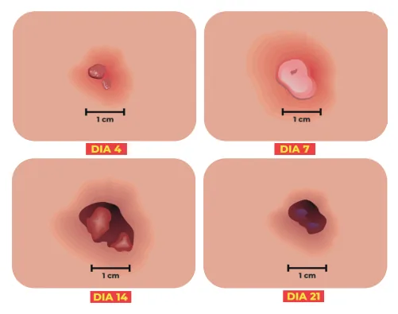

# Vacinação

<!-- page:1 -->

## Definição de Vacinas

- **Proteínas, polissacarídeos ou ácidos nucleicos** de patógenos apresentados ao sistema imune.
- Agentes vivos atenuados ou vetores capazes de induzir resposta específica.
- Objetivo: inativar, destruir ou suprimir patógeno; ganho de memória imunológica.

## Tipos de Vacinas

### Vacinas Vivas Atenuadas

- Obtidas por passagem do agente em cultura de tecido ou hospedeiros animais.
- Virulência diminuída; imunogenicidade preservada.
- **Exemplos**: BCG, Rotavírus, Pólio (Sabin-VOP), SCR, Varicela, Febre Amarela, Dengue, Tetraviral.
- **Risco**: em imunossuprimidos (virulência residual).

### Vacinas Inativadas

- Substâncias químicas usam para destruir infectividade.
- Menor imunogenicidade.
- **Exemplos**: Difteria, Tétano (toxoide), Coqueluche acelular, Influenza, Pólio (VIP), Hepatite A, COVID-19 (CoronaVac), Hepatite B, HPV.

### Vacinas Conjugadas

- Polissacarídeos associados a proteínas carreadoras.
- Aumentam imunogenicidade.
- **Exemplos**: Hib, Meningocócica, Pneumocócica.

### Vetores Virais

- **COVID-19** (AstraZeneca, Janssen): adenovírus modificado; não se replica no corpo humano.

### RNAm

- **COVID-19** (Pfizer/Moderna): RNAm encapsulado em nanopartículas lipídicas; codifica proteína Spike.

## Contraindicações Gerais

- **Hipersensibilidade grave** a componentes ou doses anteriores.
- **Vacinas vivas em imunossuprimidos**: BCG, Rotavírus, VOP, SCR, Varicela, Febre Amarela.

## Situações em que PODE Vacinar

- IVAS sem febre; diarreia; uso de antibiótico.
- Reações leves a vacinas anteriores.
- Desnutrição; doenças de pele esparsas.

---

## BCG (Bacilo Calmette-Guérin)

### Características

- **Mycobacterium bovis** vivo e atenuado.
- **Via**: intradérmica.
- **Principal objetivo**: proteção contra formas graves de TB (miliar, disseminada, meningite tuberculosa).
- **Proteção**: maior quanto mais precoce.

### Esquema

- **Dose única ao nascer**, até 4 anos, 11 meses e 29 dias.
- Intradérmica.

### Contraindicações

- **RN < 2 kg**.
- **Lesão grave de pele no braço**.
- **Imunossupressão** → risco de BCGite.

### Particularidades

- **Comunicantes domiciliares de hanseníase**: podem receber 2ª dose após 1 ano.
- **RN filhos de mães que usaram imunossupressores**: adiar vacinação até 6 meses OU contraindicar.
- **RN expostos a HIV** (infectados ou não): vacinar, exceto se sintomáticos.
- **Desde 2019**: para crianças > 6 meses sem cicatriz BCG, **não recomenda-se revacinação**.

### Evolução Esperada da Lesão

- **Semanas 1–2**: mácula avermelhada com enduração (5–15 mm).
- **Semanas 3–4**: pústula e crosta.
- **Semanas 4–5**: úlcera (4–10 mm).
- **Semanas 6–12**: cicatriz (4–7 mm) — presente em 95% dos vacinados.

**Nota**: nenhuma lesão ultrapassa 1 cm de diâmetro.

### Alerta para Eventos Adversos

| Evento | Conduta |
|---|---|
| **Úlcera > 1 cm** | Isoniazida até resolução |
| **Abscesso subcutâneo frio** | Isoniazida até resolução |
| **Abscesso subcutâneo quente** | Antibioticoterapia |
| **Linfadenopatia regional não supurada > 3 cm** | Sem isoniazida |
| **Linfadenopatia regional supurada** | Isoniazida |
| **Granuloma** | Isoniazida |
| **Cicatriz queloide** | Sem conduta |
| **Reação lupoide** | RIE 2 meses + RI 4 meses |

### Disseminação e Reativação

**Disseminação**: lesões que ultrapassam topografia locorregional → pele/linfonodos a distância, sistema osteoarticular, visceralização.

**Reativação**: reatividade de lesão já cicatrizada — associada a HIV, pós-TCTH, imunossupressores, Kawasaki, pós-infecções virais.

*Figura 1: Calendário vacinal do PNI atualizado 2025.*

*Figura 2: Evolução esperada da lesão BCG.*

---

## Hepatite B

### Plataforma

- Engenharia genética; antígeno recombinante de superfície purificado.

### Proteção

- 90–95% após esquema completo.

### Esquema Vacinal

- **Ao nascer** (primeiras 12 horas): monovalente IM; até 30 dias.
- **2, 4, 6 meses**: pentavalente IM; até 6 anos, 11 meses e 29 dias.

### Eventos Adversos

- Dor, enduração, rubor, abscessos locais.
- Febre nas primeiras 24h.
- Fadiga, tontura, cefaleia, irritabilidade, desconforto GI leve.
- Hipersensibilidade e PTI (rara).

---

## Rotavírus (VORH)

### Características

- Vírus vivos atenuados; via oral.
- Reduz sintomas; protege contra quadros graves.

### Esquema

- **2 e 4 meses**, via oral.
- 1ª dose: 1 mês 15 dias até 11 meses 29 dias.
- 2ª dose: 3 meses até 23 meses 29 dias.

### Eventos Adversos

- Sonolência (28–48%); anorexia (2–26%); irritabilidade (2–85%).
- **Invaginação intestinal**: até 2 semanas após; contraindica próxima dose.
- Respeitar idade limite é importante para evitar invaginação.

### Contraindicações

- Doença GI crônica; malformação intestinal.
- Antecedente de invaginação intestinal.
- Imunodeficiência.

---

## Pentavalente (DTP + Hib + HepB)

### Componentes

- **Difteria + Tétano + Pertussis** (DTP).
- **Haemophilus influenzae tipo B** (Hib).
- **Hepatite B**.

### Esquema

- **2, 4, 6 meses**: IM.
- **Reforços**: 15 meses e 4 anos.
- **Reforço a cada 10 anos**: dT (antecipar a 5 anos se ferimentos graves ou contato com difteria).

### Eventos Adversos Locais

- Flogisto, nodulação, abscesso frio ou quente.

### Eventos Adversos Sistêmicos

| Evento | Descrição | Conduta |
|---|---|---|
| **Febre** | 41–58% | — |
| **Episódio Hipotônico-Hiporresponsivo (EHH)** | Diminuição tônus, hiporresponsividade, palidez/cianose; primeiras 6–48h | Substituir Pertussis por Acelular (DTPa) |
| **Convulsão** | Primeiras 72h | Mudar para DTPa |
| **Encefalopatia** | Rara (0–10,5/1M doses) | Contraindica componente Pertussis; completar com DT, HepB, Hib separados |
| **Anafilaxia** | — | Contraindica Penta e todos componentes |
| **Apneia** | Em prematuros < 33 sem/< 1500g | Preferir DTP isolada; depois HepB e Hib |

### Contraindicações

- Crianças > 7 anos (substituir por dT).
- Eventos adversos graves em dose anterior (EHH, convulsão, anafilaxia, encefalopatia aguda).

---

## Poliomielite

- **1989**: último caso no Brasil.
- **1994**: Brasil certificado como área livre de poliovírus selvagem.
- **Esquema**: VIP (inativada) em **2, 4, 6 e 15 meses**.
- **Desde nov/2024**: MAS substitui VOP pelos reforços por VIP.

---

## Meningocócica (MenC e MenACWY)

### Atualização 2025

- **MenC**: 2 doses (3 e 5 meses) + 1 reforço MenACWY aos 12 meses.
- Polissacarídeo conjugado.

---

## Referências

Figura 1: Calendário vacinal do PNI atualizado 2025.

Figura 2: Evolução esperada da lesão BCG e eventos adversos pós-vacinação.
