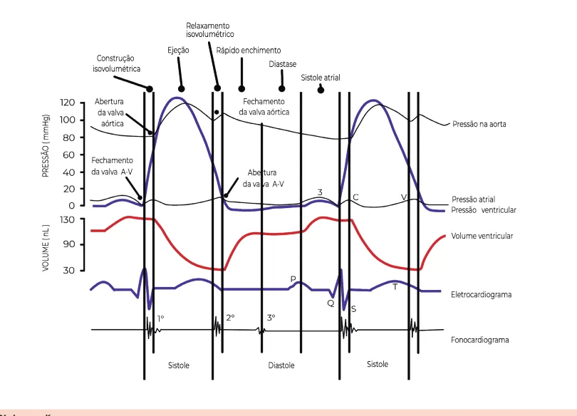
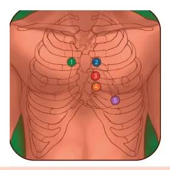

# Valvopatias

<!-- page:1 -->

Valvopatias (CM)

## ALTERAÇÕES SEMIOLÓGICAS

Normal

- a.contração atrial

- c.Fechamento tricúspide

- x.relaxamento atrial

- v.enchimento atrial

- Y.abertura tricúspide de B2 (inspiração).

Pulso Venoso Jugular Desdobramento Desdobramento fisiológico de B2

Etiologia Semio Sinal de Doenças da valva pulso em aórtica ou doenças d’água Insuficiência da aorta (síndrome Corriga Aórtica de Marfan, HAS, de Mulle sífilis) de Quin diverg Pulso p et tardu Degenerativa sistólico Estenose Aórtica (ou reumática) aórtico c tardio e ab de Etiologia Semio Sopro dias Estenose Mitral Reumática rufl Secundária (dilatação anel/ Sopro s Insuficiência Mitral VE/isquemia) regurgita Reumática Prolapso área m da valva mitral Tratamento: valvopatia grave, sintomática = troca valva As medicações ajudam com os sintomas mas não alter Doenças Principais alterações Associadas

- • BAVT

- Onda a em “canhão” z •FA

- Onda a ausente z •Estenose

- Onda a gigante tricúspide ou

- Onda v gigante disfunção VD

- •Insuficiência tri.

- Persistente: ins e exp (pior na insp).

- BRD, HP

- Fixo: ins e exp igualmente

- CIA

- Paradoxal: apenas na exp.

- BRE, disf. VE.

(oposto do fisiológico) Sinais de ologia Outros Gravidade Musset, m martelo a ou de Tratar também Presença dos sinais an, sinal a aorta se diâmetro semiológicos.

er, sinal > 45mm. ncke, PA gente parvus

- EAo paradoxal: TC us, sopro Presença dos sinais

- com escore de em foco semiológicos cálcio com pico Área valvar < 1cm²

- Eao BF, BG: eco com bafamento Gmed > 40 mmHg dobutamina ologia Outros stólico em <1,5 cm² Gmed > Varfarina sempre.

B2 Sinais de Gravidade Área valvar Associação com FA: flar 10mmHg Estalido de Perda do reforço abertura precoce. pré-sistólico do sopro.

Irradiação do sopro para as costas sistólico Ictus desviado para IM secundária: tratar ativo em baixo e para a E B1 doença de base.

mitral. hipofonética. Parâmetros Eco ar. ram o desfecho.

---

<!-- page:2 -->

## SEMIOLOGIA CARDIOVASCULAR

Onda V gigante

## PULSO VENOSO JUGULAR

É um pulso proveniente da veia jugular interna, sendo diretamente ligado ao funcionamento do átrio direito.

diretamente ligado ao funcionamento do átrio direito. Na prática, observa-se a veia jugular externa pela praticidade do acesso no exame físico.

- Gráfico em condições de normalidade Onda A = contração atrial; Descenso X = relaxamento atrial; Onda C = fechamento da tricúspide; Onda V = enchimento atrial; A Descenso Y = abertura da tricúspide. F alterações clínicas na curva do pulso venoso jugular:

Figura 1: Pulso venoso jugular A partir de tal análise, é possível avaliar determinadas Onda A gigante: estenose tricúspide, disfunção de VD;

Figura 2: Onda A gigante

- Pode ser considerada uma fusão das ondas A e C.

- Onda A em “canhão”: BAVT;

- Onda A ausente: fibrilação atrial; C

- Figura 5: Ciclo cardíaco Figura 3: Onda V gigante

- Insuficiência tricúspide – pela regurgitação, causa maior enchimento atrial, correspondido pela onda V gigante.

AUSCULTA CARDÍACA Focos de ausculta

1. Aórtico;

2. Pulmonar;

3. Aórtico acessório;

4. Tricúspide;

5. Mitral.

Figura 4: Focos de ausculta

- Ausculta em campânula: evidencia os sons graves;

- É útil para ausculta de B3, B4 e ruflar mitral.

## CICLO CARDÍACO

- Verificar Figura 5

---

<!-- page:3 -->

- B1 Fechamento das valvas atrioventriculares:

mitral e tricúspide. ESTENOSE AÓRTICA

- B2 Quadro clínico Caracteriza o fechamento das valvas Tríade: angina + síncope + dispneia aos esforços.

aórtica e pulmonar;

- Angina: desbalanço da oferta/demanda de oxigênio; Desdobramento fisiológico de B2 caracterizado Síncope pode ser causa por pelo atraso de P2 na inspiração;

- Débito cardíaco fixo (PA = RVP x DC): em situações Na inspiração, há redução da pressão de esforço físico, há tendência de vasodilatação. Denota, então, o atraso no fechamento da valva hipotensão e síncope;

intratorácica, favorecendo o retorno venoso ao No entanto, à medida que o débito cardíaco lado direito do coração. Assim, o enchimento permanece fixo, não é possível compensar a menor ventricular direito é prolongado; resistência periférica. Assim, há evolução com pulmonar (P2), na inspiração.

- Fibrose e taquiarritmias; Desdobramento persistente de B2:

- Bradiarritmias. BRD ou hipertensão pulmonar → acontece Dispneia aos esforços na inspiração e na expiração, mas é pior

- É o sintoma mais comum, em virtude do quadro de na inspiração. disfunção diastólica associada ao débito cardíaco fixo. CIA → desdobramento igualmente presente na Hemorragia digestiva associada à EAo inspiração e na expiração.

- Síndrome de Heyde (descrita em 1958); Desdobramento paradoxal de B2:

- Na passagem do FvW pela valva aórtica, há clivagem BRE → oposto do fisiológico, presente apenas do fator de Von Willebrand;

na expiração;

- Em geral, ocorre em conjunto com angiodisplasias

- B3 do intestino; Protodiastólico (isto é, ocorre logo após B2);

- Tratamento: troca de valva aórtica. Para fins de avaliação, considere disfunção sistólica!

Ou seja, fração de ejeção reduzida. DICA! Para a prova, idoso + síncope + sopro?

- B4 Estenose aórtica! Telediastólico: se assemelha com desdobramento de B1; Exame físico Para fins de avaliação, considerar disfunção Pulso parvus et tardus – sentido na carótida → sinal diastólica. Isto é, coração pouco complacente e, de gravidade;

muitas vezes, hipertrófico.

## SOPROS CARDÍACOS

- Definição São vibrações audíveis causadas pelo aumento da turbulência na passagem do sangue pela circulação. Figura 6: Pico lento e descenso tardio

Etiologia Identificação

- Sopro sistólico em foco aórtico com pico tardio e

- Depende de identificação do foco, momento no ciclo abafamento de B2;

cardíaco e aspecto.

- Fenômeno de Gallavardin: descreve-se como um Foco: mitral, aórtico, tricúspide e pulmonar; sopro piante em foco mitral, em pacientes com Momento no ciclo: sístole ou diástole; estenose aórtica grave, indica calcificação da aorta. Aspecto: ejetivo, regurgitativo, aspirativo e em Ecocardiograma ruflar. Figura 8

- Critérios de gravidade:

Sopros de focos aórtico e pulmonar

- Sístole: não abre adequadamente (estenose aórtica ou Gradiente médio VE-Ao ≥ 40 mmHg. Área valvar pulmonar), aspecto ejetivo; (AV) ≤ 1 cm2;

- Diástole: não fecha apropriadamente (insuficiência aórtica e pulmonar), aspecto aspirativo. Estenose aórtica de baixo fluxo e baixo gradiente

Sopros de focos mitral e tricúspide

- Parâmetros:

- Sístole: não fecha adequadamente (insuficiência mitral e tricúspide), aspecto regurgitativo; Área valvar (AV) ≤ 1 cm2. FEVE ≤ 40%. Gradiente médio

- Diástole: não abre apropriadamente (estenose mitral e VE-Ao < 40 mmHg;

tricúspide), aspecto em “ruflar”.

---

<!-- page:4 -->

- Conduta: ecocardiograma com dobutamina: Associações - fibrilação atrial: frequente! É útil para avaliar o que surgiu primeiro: a fração

- O paciente deve ser anticoagulado, sempre de ejeção reduzida ou a estenose aórtica grave com varfarina! Na presença de reserva contrátil (aumento ≥ 20% | Existem piores desfechos associados ao uso do volume sistólico ejetado e/ou aumento > 10 de DOACs.

(dobutamina favorece o inotropismo). | Independentemente do CHA2DS2-VASc. mmHg no gradiente médio VE/Aorta), se a área

- Pelo quadro de fibrilação, ocorre perda do reforço prévalvar AUMENTAR > 0,2 cm², quer dizer que a fração sistólico do sopro, pela ausência de contração atrial.

de ejeção está reduzida por outra etiologia, ou seja, a área valvar estava < 1 cm² simplesmente porque DICA! A estenose mitral poupa o ventrículo esquerdo!

estava passando pouco volume por ali, em face da Caso exista disfunção ventricular associada, FEVE reduzida; considerar outro diagnóstico associado!

| Se houver reserva contrátil e o gradiente VE-AO aumentar e a AV permancer reduzida fração de Sinais de gravidade no exame físico incluem ejeção reduzida secundária à EAo grave.

- Fácies mitralis;

Estenose aórtica paradoxal

- Estalido de abertura precoce;

- Parâmetros: área valvar ≤ 1 cm2; FEVE preservada;

- B1 hiperfonética;

gradiente médio VE-Ao < 40 mmHg. Volume sistólico <

- B2 hiperfonética (hipertensão pulmonar);

35 mL/m2;

- Congestão pulmonar;

- Conduta: tomografia com escore de cálcio da valva

- Presença de insuficiência tricúspide;

aórtica se escore de cálcio > 1.300 em mulheres ou

- Sopro de Graham Steel (regurgitação pulmonar na

2.000 em homens, está indicada intervenção. hipertensão pulmonar).

## INSUFICIÊNCIA AÓRTICA

É um sopro diastólico, de caráter aspirativo, mais audível em foco aórtico e aórtico acessório. Etiologia

- Doenças da valva aórtica ou doenças da aorta;

- Alguns exemplos: Síndrome de Marfan, HAS, sífilis.

Exame físico

- Sinais semiológicos marcam gravidade: Sinal de Musset: tremor da cabeça a cada batimento cardíaco; Pulso em martelo d’água ou de Corrigan: distensão rápida e queda abrupta;

A manobra pode ser sensibilizada com elevação do membro superior do paciente.

- Sinal de Muller: pulsação da úvula;

- Sinal de Quincke: pulsação do leito ungueal;

- PA divergente, exemplo: 140 x 40 mmHg.

## ESTENOSE MITRAL

Sopro diastólico em ruflar em foco mitral com reforço pré-sistólico. Figura 7: Paciente com faceis mitralis Etiologia

- Reumática – principal! INSUFICIÊNCIA MITRAL É a principal sequela tardia da doença! Primária x secundária

Epidemiologia Primária

- Acomete mais mulheres jovens;

- Doença do aparato valvar - cúspides, cordoalhas,

- Neste sentido, é frequente o diagnóstico na gestação. cordas tendíneas; A paciente inicia um quadro clínico de cardiopatia.

- Reumática (mais comum);

Característica do sopro

- Prolapso da valva mitral (segunda mais comum)

- Sopro diastólico em ruflar; protusão das cúspides para o Ae >= 2mm;

- Localização: foco mitral; Secundária

- Apresenta reforço pré-sistólico.

- Dilatação do anel valvar, do VE ou isquemia → muito comum na insuficiência cardíaca → tratar causa de base.

---

<!-- page:5 -->

Figura 8: Características semiológicas (sopro) das valvopatias

## TRATAMENTO DAS VALVOPATIAS REFERÊNCIAS

- Valvopatia grave (parâmetros ecocardiográficos) e Figura 7: Paciente com faceis mitralis sintomática → abordar com troca valvar; BRAUNWALD, E. Tratado de doenças cardiovasculares. 9. ed. São Paulo: O tratamento clínico é apenas sintomático, não Elsevier, 2018.

sendo capaz de reduzir a mortalidade.

- Pré-operatório de cirurgia cardíaca. Em geral, pedir CATE ou angioTC de coronárias se o paciente > 40 anos.

