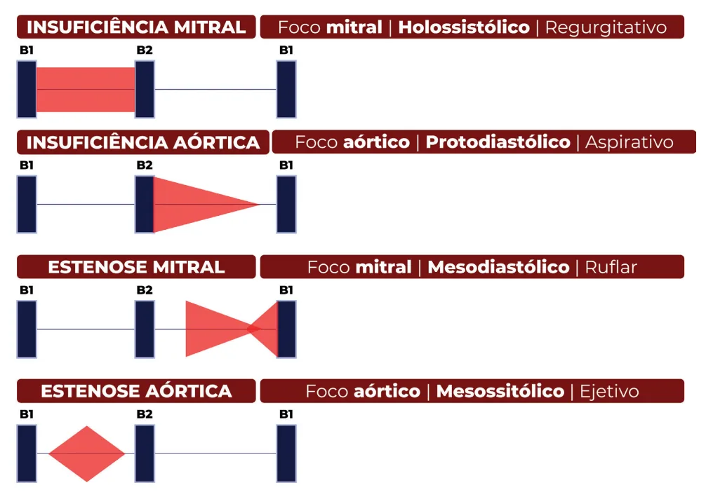

# Valvopatias

<!-- page:1 -->

## Semiologia Cardiovascular

### Pulso Venoso Jugular

É um pulso proveniente da **veia jugular interna**, sendo diretamente ligado ao funcionamento do **átrio direito**. Na prática, observa-se a veia jugular externa pela praticidade do acesso no exame físico.

#### Gráfico em Condições de Normalidade

- **Onda A**: contração atrial;
- **Descenso X**: relaxamento atrial;
- **Onda C**: fechamento da tricúspide;
- **Onda V**: enchimento atrial;
- **Descenso Y**: abertura da tricúspide.

*Figura 1: Pulso venoso jugular.*

#### Alterações Clínicas na Curva do Pulso Venoso Jugular

- **Onda A gigante**: estenose tricúspide, disfunção de VD;
- **Onda A em "canhão"**: BAVT (bloqueio atrioventricular total);
- **Onda A ausente**: fibrilação atrial;
- **Onda V gigante**: insuficiência tricúspide — pela regurgitação, causa maior enchimento atrial.

*Figura 2: Onda A gigante.*

*Figura 3: Onda V gigante.*

### Ausculta Cardíaca

#### Focos de Ausculta

1. Aórtico;
2. Pulmonar;
3. Aórtico acessório;
4. Tricúspide;
5. Mitral.

*Figura 4: Focos de ausculta.*

**Nota**: ausculta em campânula evidencia os sons graves — útil para ausculta de B3, B4 e ruflar mitral.

### Ciclo Cardíaco

*Figura 5: Ciclo cardíaco.*

#### B1 — Primeiro Som Cardíaco

Caracteriza o **fechamento das valvas atrioventriculares**: mitral e tricúspide.

#### B2 — Segundo Som Cardíaco

Caracteriza o **fechamento das valvas aórtica e pulmonar**.

##### Desdobramento Fisiológico de B2

Na inspiração, há redução da pressão intratorácica, favorecendo o retorno venoso ao lado direito do coração. Assim, o enchimento ventricular direito é prolongado, denotando o atraso no fechamento da valva pulmonar (P2), na inspiração.

- **Desdobramento persistente de B2**: BRD ou hipertensão pulmonar → acontece na inspiração e na expiração, mas é pior na inspiração;
- **Desdobramento fixo**: CIA → desdobramento igualmente presente na inspiração e na expiração;
- **Desdobramento paradoxal de B2**: BRE → oposto do fisiológico, presente apenas na expiração.

#### B3 — Terceiro Som Cardíaco

Protodiastólico (isto é, ocorre logo após B2). Para fins de avaliação, considere **disfunção sistólica** (fração de ejeção reduzida).

#### B4 — Quarto Som Cardíaco

Telediastólico: assemelha-se com desdobramento de B1. Para fins de avaliação, considerar **disfunção diastólica** — coração pouco complacente e, muitas vezes, hipertrófico.

---

<!-- page:2 -->

## Sopros Cardíacos

### Definição

Vibrações audíveis causadas pelo aumento da turbulência na passagem do sangue pela circulação.

### Identificação do Sopro

Depende de:
- **Foco**: mitral, aórtico, tricúspide ou pulmonar;
- **Momento no ciclo**: sístole ou diástole;
- **Aspecto**: ejetivo, regurgitativo, aspirativo ou em ruflar.

*Figura 6: Pico lento e descenso tardio.*

### Sopros de Focos Aórtico e Pulmonar

- **Sístole**: não abre adequadamente (**estenose aórtica** ou pulmonar) — aspecto ejetivo;
- **Diástole**: não fecha apropriadamente (**insuficiência aórtica** ou pulmonar) — aspecto aspirativo.

### Sopros de Focos Mitral e Tricúspide

- **Sístole**: não fecha adequadamente (**insuficiência mitral** ou tricúspide) — aspecto regurgitativo;
- **Diástole**: não abre apropriadamente (**estenose mitral** ou tricúspide) — aspecto em "ruflar".

---

## Estenose Aórtica

### Quadro Clínico

**Tríade clássica**: **angina + síncope + dispneia aos esforços**.

#### Angina

Desbalanço da oferta/demanda de oxigênio.

#### Síncope

Pode ser causada por **débito cardíaco fixo** (PA = RVP × DC):
- Em situações de esforço físico, há tendência de vasodilatação;
- Porém, à medida que o débito cardíaco permanece fixo, não é possível compensar a menor resistência periférica;
- Assim, há evolução com hipotensão e síncope.

#### Dispneia aos Esforços

É o sintoma mais comum, em virtude do quadro de **disfunção diastólica associada ao débito cardíaco fixo**.

#### Hemorragia Digestiva Associada à Estenose Aórtica

- **Síndrome de Heyde** (descrita em 1958): na passagem do FvW (fator de Von Willebrand) pela valva aórtica, há clivagem do fator;
- Em geral, ocorre em conjunto com **angiodisplasias do intestino**;
- Tratamento: troca de valva aórtica.

#### Fibrose e Taquiarritmias; Bradiarritmias

Associadas à doença.

### Exame Físico

**Pulso parvus et tardus** — sentido na carótida → sinal de gravidade.

*Figura 8: Características semiológicas (sopro) das valvopatias.*

- **Sopro sistólico em foco aórtico** com pico tardio e abafamento de B2;
- **Fenômeno de Gallavardin**: descreve-se como um sopro piante em foco mitral, em pacientes com estenose aórtica grave — indica calcificação da aorta.

### Critérios de Gravidade (Ecocardiograma)

- **Gradiente médio VE-Aórtica ≥ 40 mmHg**;
- **Área valvar (AV) ≤ 1 cm²**.

### Estenose Aórtica de Baixo Fluxo e Baixo Gradiente

#### Parâmetros

- **Área valvar (AV) ≤ 1 cm²**;
- **FEVE ≤ 40%**;
- **Gradiente médio VE-Aórtica < 40 mmHg**.

#### Conduta

**Ecocardiograma com dobutamina**: é útil para avaliar o que surgiu primeiro — fração de ejeção reduzida ou estenose aórtica grave com reserva contrátil (aumento ≥ 20% do volume sistólico ejetado e/ou aumento > 10 mmHg no gradiente médio VE/Aorta).

Se a área valvar **aumentar > 0,2 cm²**, quer dizer que a fração de ejeção está reduzida por outra etiologia (isto é, a área valvar estava < 1 cm² simplesmente porque estava passando pouco volume, em face da FEVE reduzida).

Se houver **reserva contrátil e o gradiente VE-Aorta aumentar e a AV permanecer reduzida** → fração de ejeção reduzida secundária à estenose aórtica grave.

### Estenose Aórtica Paradoxal

#### Parâmetros

- **Área valvar ≤ 1 cm²**;
- **FEVE preservada**;
- **Gradiente médio VE-Aórtica < 40 mmHg**;
- **Volume sistólico < 35 mL/m²**.

#### Conduta

Tomografia com escore de cálcio da valva aórtica:
- Se escore de cálcio > **1.300 em mulheres** ou **2.000 em homens**, está indicada intervenção.

---

<!-- page:3 -->

## Insuficiência Aórtica

**Sopro diastólico, de caráter aspirativo**, mais audível em foco aórtico e aórtico acessório.

### Etiologia

- **Doenças da valva aórtica ou doenças da aorta**;
- Exemplos: **Síndrome de Marfan, HAS, sífilis**.

### Exame Físico — Sinais Semiológicos de Gravidade

- **Sinal de Musset**: tremor da cabeça a cada batimento cardíaco;
- **Pulso em martelo d'água ou de Corrigan**: distensão rápida e queda abrupta (a manobra pode ser sensibilizada com elevação do membro superior do paciente);
- **Sinal de Muller**: pulsação da úvula;
- **Sinal de Quincke**: pulsação do leito ungueal;
- **PA divergente**: exemplo: 140 × 40 mmHg.

---

## Estenose Mitral

**Sopro diastólico em ruflar** em foco mitral com reforço pré-sistólico.

### Etiologia

- **Reumática** — principal etiologia;
- É a **principal sequela tardia da doença reumática**.

### Epidemiologia

- Acomete mais **mulheres jovens**;
- Neste sentido, é frequente o diagnóstico na **gestação** — a paciente inicia um quadro clínico de cardiopatia.

### Característica do Sopro

- **Sopro diastólico em ruflar**;
- **Localização**: foco mitral;
- **Apresenta reforço pré-sistólico**.

### Sinais de Gravidade no Exame Físico

- **Fácies mitralis**;

*Figura 7: Paciente com fácies mitralis.*

- **Estalido de abertura precoce**;
- **B1 hiperfonética**;
- **B2 hiperfonética** (hipertensão pulmonar);
- **Congestão pulmonar**;
- **Presença de insuficiência tricúspide**;
- **Sopro de Graham Steel** (regurgitação pulmonar na hipertensão pulmonar).

**DICA!** A estenose mitral poupa o ventrículo esquerdo! Caso exista disfunção ventricular associada, considerar outro diagnóstico associado!

### Associações — Fibrilação Atrial

- **Frequente!** O paciente deve ser **anticoagulado, sempre com varfarina**;
- Existem piores desfechos associados ao uso de DOACs, independentemente do CHA2DS2-VASc;
- Pelo quadro de fibrilação, ocorre **perda do reforço pré-sistólico do sopro**, pela ausência de contração atrial.

---

<!-- page:4 -->

## Insuficiência Mitral

### Primária

**Doença do aparato valvar** — cúspides, cordoalhas, cordas tendíneas.

#### Etiologia

- **Reumática** (mais comum);
- **Prolapso da valva mitral** (segunda mais comum) — protusão das cúspides para o átrio ≥ 2 mm.

#### Característica do Sopro

- Sopro **sistólico** em **foco mitral**;
- Aspecto **regurgitativo**;
- **Irradiação do sopro para as costas**.

#### Exame Físico

- **B1 hipofonética** ou ausente;
- **Ictus desviado para baixo e para a esquerda**;
- **Sopro de alta frequência**.

### Secundária

- **Dilatação do anel valvar, do VE ou isquemia** — muito comum na insuficiência cardíaca;
- Conduta: **tratar a causa de base**;
- **IM secundária**: tratar a doença de base.

---

## Tratamento das Valvopatias

- **Valvopatia grave** (parâmetros ecocardiográficos) **e sintomática** → abordar com **troca valvar**;
- **O tratamento clínico é apenas sintomático**, não sendo capaz de reduzir a mortalidade;
- **Pré-operatório de cirurgia cardíaca**: em geral, pedir **CATE ou angioTC de coronárias se o paciente > 40 anos**.

**DICA!** Para a prova: idoso + síncope + sopro? **Estenose aórtica!**

## Referências

Figura 7: Paciente com fácies mitralis.

BRAUNWALD, E. Tratado de doenças cardiovasculares. 9. ed. São Paulo: Elsevier, 2018.

