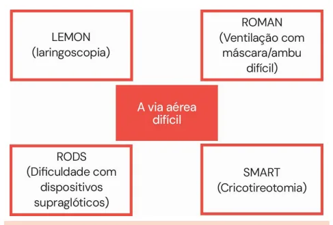
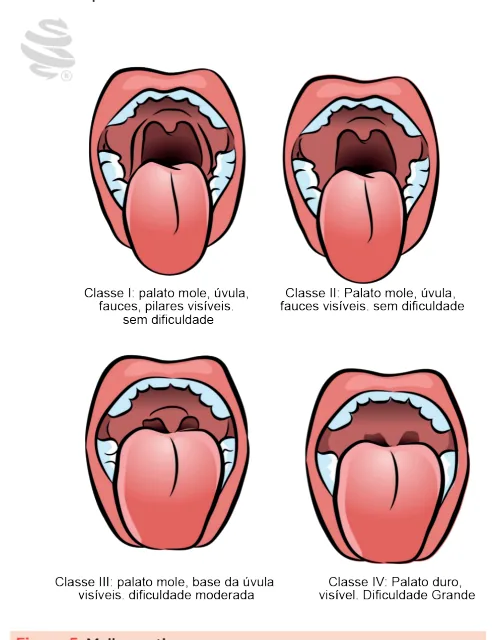
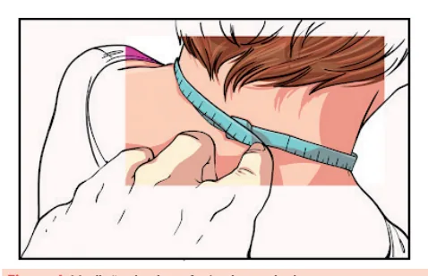
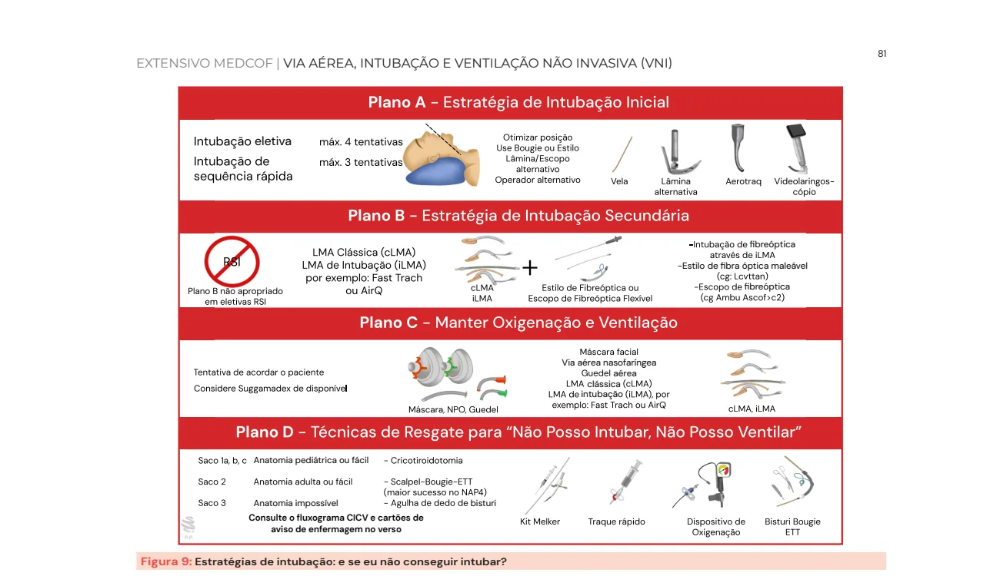
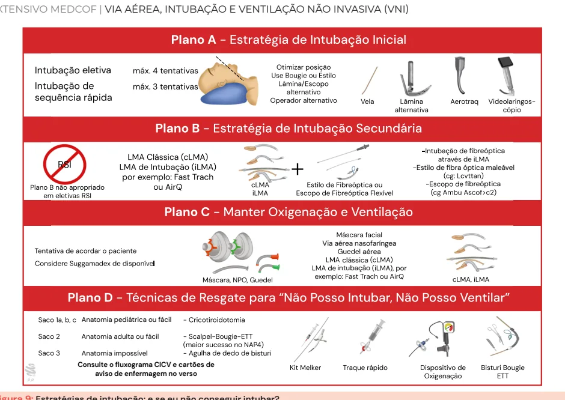

# Via Aérea, Intubação e Ventilação Não Invasiva (vni)

<!-- page:1 -->

## VIA AÉREA, INTUBAÇÃO E

## VENTILAÇÃO NÃO INVASIVA (VNI)

Via aérea e intubação (CM) INTRODUÇÃO | 1. Preparação:

- Múltiplas causas de IRpA: | Conferência de instrumentos e equipe; IRpA I: hipoxêmica → PO2 baixo; | Avaliação e estabelecimento de plano II: hipercápnica → PCO2 alto; para abordagem da “via aérea - via aérea III: perioperatório; difícil”, acima. IV: choque. | 2. Pré-oxigenação:

- Múltiplas formas de tratamento: | MNR, VNI, CNAF ou ambu → pré-oxigenação Oxigenoterapia; 3-5 minutos antes da intubação; VNI; | Objetiva permitir um maior tempo de CNAF; apneia segura. IOT; | 3. Pré-tratamento (otimização pré-intubação): toracostomia; | Preparar o paciente para otimizar o momento pericardiocentese. da intubação → estabilizar;

- Oxigenoterapia pode ser feita de maneira passiva | Fentanil é droga simpatolítica que pode ser com cateter nasal, máscara de Venturi ou máscara usada como pré-tratamento quando se busca não reinalante: simpatólise → evita aumento da pressão Caso não haja melhora, talvez deva-se associada a laringoscopia (dissecção de considerar utilizar pressão positiva. aorta, AVC etc.).

- Pressão positiva pode ser fornecida com VNI, | 4. Paralisia: VNI indicada nos casos de edema agudo de cardiodepressores), quetamina e etomidato pulmão cardiogênico e DPOC: (preferíveis pela cardioestabilidade); Pode ser considerada na asma, pneumonia, | Bloqueador neuromuscular: succinilcolina imunossuprimidos, pré e pós-extubação; (cuidado com neuropatias, grande queimados Contraindicada no rebaixamento do nível de e distrofias musculares → hipercalemia) consciência, vômitos e alterações faciais. ou rocurônio.

catéter nasal de alto fluxo (CNAF) e a própria IOT: | Hipnóticos: midazolam, propofol (ambos mais

- Critérios de Walls para IOT: | 5. Posicionamento: Perda da perviedade da via aérea; | Sniff position. Falha na ventilação ou oxigenação; | 6. Passar o tubo e confirmação: Impressão subjetiva de desfecho ruim no quadro | Capnografia, visualização direta, USG etc.

clínico do paciente. | 7. Pós-intubação - paciente começou a dessaturar? DOPES e DOTTS: VIA AÉREA DIFÍCIL | DOPES: deslocamento do tubo, obstrução,

- Via aérea difícil (anatômica e fisiológica) → não pneumotórax, equipamento, auto-PEEP;

conseguiu intubar? Via aérea falha; | DOTTS: desconectar o paciente do ventilador,

- Preditores de via aérea difícil: LEMON, MOANS, utilizar BVM, 02 a 100%, corrigir

RODS, SMART e Mallampati; auto-peep, utilizar USG;

- Cormack-Lehane: | Lembrar de ventilar o paciente enquanto isso Critério na laringoscopia. → desconectar o paciente e ventilar a 100%.

## INTUBAÇÃO OROTRAQUEAL OUTROS DISPOSITIVOS NÃO INVASIVOS

- Intubação de sequência rápida utiliza um hipnótico

- VNI: eficaz em DPOC e edema agudo de pulmão e um bloqueador neuromuscular logo em seguida: (EAP) cardiogênico: Sequência lenta geralmente é utilizada em | Pode ser utilizado em: SDRA, asma, pacientes que não auxiliam na pré-oxigenação pós-extubação, pré-ox, pneumonia;

→ prescrição de droga dissociativa antes (como | Cuidado com as contraindicações → RNC, quetamina) para poder realizar a pré-oxigenação vômitos, PCR, necessidade de IOT.

no paciente “sedado”.

- CNAF: muito bom em insuficiência respiratória

- Lembrar dos 7 P’s da intubação: hipoxêmica aguda.

---

<!-- page:2 -->

## INTRODUÇÃO

- Considerar uso nas seguintes situações: Pneumonia;

CAUSAS DE INSUFICIÊNCIA RESPIRATÓRIA | Asma;

## AGUDA (IRPA)

- Infecções, asma, DPOC, anafilaxia, choque, doenças neuromusculares, obstrução de vias aéreas, edema agudo de pulmão, alterações metabólicas, atelectasias e trauma;

- Múltiplos modos de tratamento (outros pontos para auxiliar no manejo): Oxigenoterapia, VNI, CNAF, IOT, toracostomia, pericardiocentese, broncodilatadores, adrenalina, nitroglicerina.

## CLASSIFICAÇÃO

Clássica I. Hipoxêmica (PaO < 60); II. Hipercápnica (PaCO > 45); III. Perioperatório (associada à atelectasia, por exemplo);

IV. Choque (hipoperfusão, inclusive pulmonar). Abordagem prática na emergência

- Tipo I: pacientes com aumento do trabalho respiratório respondem com suporte de oxigenoterapia;

(taquicardia, taquipneia, sudorese) → geralmente

- Tipo II: alvéolos destruídos (shunt) → pressão positiva

(VNI) favorece o manejo;

- Tipo III: não conseguem proteger a via aérea → necessitam de intubação imediata;

- Tipo IV: apneicos (não respiram) → necessitam de intubação imediata.

## DISPOSITIVOS INICIAIS

Catéter nasal

- Indicado para hipoxemia leve: Oferta 24%–30% de FiO2; Altos fluxos irritam o nariz.

- Não temos controle fino da FiO2.

Máscara de Venturi

- Entrega FiO2 constante, de acordo com a escolha do médico: Necessita de fluxo correto para entregar FiO2 correta → não entrega maior quantidade de FiO2 com maior fluxo; Oferta 24%–60% de FiO2.

Máscara não reinalante

- Indicada para hipoxemia mais grave → entrega alta FiO2: Oferta 70% de FiO2 com 15 L/min → consegue entregar próximo de 100% de FiO2 no flush rate; Sempre checar se o reservatório está cheio (para evitar reinalação).

## VNI E CNAF

## VNI – VENTILAÇÃO NÃO INVASIVA

- Terapia de primeira linha: diminui a mortalidade: EAP (edema agudo de pulmão) cardiogênico; DPOC (especialmente em pacientes com hipercapnia e acidose). | Síndrome da hipoventilação da obesidade; Imunossuprimido; Doença neuromuscular; SDRA leve; Extubação; Pré-oxigenação.

- Preditores de falha de VNI: APACHE II > 29; Glasgow < 11; Frequência respiratória (FR) > 30; pH < 7,25, índice de Tobin (FR/volume corrente) > 105.

- Contraindicações da VNI: Necessidade de IOT ou VMI; PCR; Não protege via aérea; Secreção abundante; Agitação ou recusa; Falência orgânica não respiratória; Trauma; Deformidade facial; Cirurgia facial ou neurocirurgia recente; Obstrução de via aérea; Anastomose esofágica recente.

o | Rebaixamento do nível de consciência;

## CNAF – CATETER NASAL DE ALTO FLUXO

- Possíveis indicações: Insuficiência respiratória hipoxêmica aguda: redução de IOT quando comparado com suporte convencional de O2 (principalmente em relação Insuficiência respiratória aguda em imunossuprimidos: Redução de IOT quando comparado com suporte convencional de O2. Pós-extubação: controverso; Suporte de O2 durante a intubação; Superior ao suporte convencional de O2: Inferior a VNI.

PaO2/ FiO2 > 200).

- Não é custo efetivo → opção quando paciente já está em uso;

- Verificar Figura 1 na próxima página.

## VIA AÉREA E INTUBAÇÃO

## OROTRAQUEAL

## INDICAÇÃO

- Segundo o manual de via aérea na emergência do aérea definitiva: 1. Há falha em manter a via aérea protegida/pérvia? 2. Há falha na ventilação ou oxigenação? 3. Há necessidade de se antecipar a um possível desfecho clínico desfavorável?

Walls, temos três indicações clássicas para indicar via

---

<!-- page:3 -->

Pacientes submetidos ao TRE Recomendado em DPOC PaCO >45 mmHg Falha do TRE VNI Facilit TRE bem-sucedido VNI Preven IResp VNI Curat Desmame bem-sucedido após 48h Figura 1: Uso da VNI na extubação.

- Intubação de sequência rápida utiliza um hipnótico e um bloqueador neuromuscular logo em seguida: Sequência lenta geralmente é utilizada em pacientes que não auxiliam na pré-oxigenação quetamina) para poder realizar a pré-oxigenação no paciente “sedado”.

→ prescrição de droga dissociativa antes (como

## DEFINIÇÕES

Via aérea difícil Aquela em que a avaliação pré-procedimento identifica atributos que predizem laringoscopia, intubação, ventilação com bolsa-válvula-máscara (BVM), uso de dispositivos supraglóticos ou via aérea cirúrgica mais difíceis do que em outros pacientes sem esses atributos. P

- Via aérea fisiologicamente vs. mecanicamente difícil: Fisiológica: paciente em estado de saúde no qual o manejo pré e pós-intubação é difícil; Mecânica: paciente com via aérea que apresentará dificuldades técnicas ao procedimento, ou paciente com preditores de via aérea difícil.

Via aérea falha

- Ocorre quando o plano principal para estabelecer a via aérea avançada falha e é necessário usar planos de resgate: Falha em manter a oxigenação adequada após uma ou mais laringoscopias; Falha de três tentativas de intubação por um médico experiente, mesmo com saturação adequada; Diante de deterioração rápida do quadro clínico.

- Sempre tentar de formas diferentes após falha de intubação (não insistir na mesma estratégia após falha inicial da mesma).

- Verificar Figura 2 . >45 mmHg tadora ntiva fatores de risco para falência respiratória ativa exceto em pacientes cirúrgicos

Recomendado em pacientes com Sem evidência de benefícios Figura 2: Preditores de via aérea difícil.

## PREDITORES DE VIA AÉREA DIFÍCIL

Tabela 1: Preditores de via aérea difícil. MOANS (preditor de LEMON (preditor de ventilação difícil) intubação difícil)

M – Selo da máscara. L – Olhar (look). O – Obstrução/obesidade. E – Avaliar 3-3-2 A – Idade (age) > 55 anos.

(evaluate). N – Não tem dentes. M – Mallampati. S– Pulmão stiff (rígido) O – Obstrução/obesidade. ou alteração de coluna N – Pescoço (neck).

cervical. RODS (dispositivos SHORT (preditor de via supraglóticos) aérea cirúrgica difícil) R – Movimentação restrita da boca. S – Cirurgia (surgery).

O – Obstrução. H – Hematoma. D – Anatomia distorcida. O – Obesidade. S – Pulmão stiff (rígido) R – Radiação.

ou alteração de coluna T – Tumor. cervical.

---

<!-- page:4 -->

- Upper-Lip bite test: AVALIAÇÃO DURANTE A LARINGOSCOPIA

- Classificação de Cormack e Lehane: Cormack e Lehane 2b e 3 → indicação do uso

Figura 3: Upper-lip bite test.

- Circunferência cervical: considerado bom preditor de via aérea difícil quando maior que 40 cm.

Figura 4: Medição da circunferência cervical.

- Mallampati: Cormack e Lehane 4 → contraindicação ao uso de bougie.

Figura 5: Mallampati. de bougie; Figura 6: Classificação de Cormack e Lehane.

## O BOUGIE

- Dispositivo facilitador de IOT ( Figura 7 ).

- Funciona como um guia colocado na via aérea, garantindo que está no lugar certo: Em seguida, insere-se o tubo no trajeto do bougie, assegurando assim que estará na via aérea; Uso com a extremidade curva na frente.

D.V Figura 7: Bougie – uso com a extremidade curva.

---

<!-- page:5 -->

## OS 7 P´S DA INTUBAÇÃO

- Propofol e midazolam são menos utilizados pelo efeito de depressor do sistema cardiovascular, que

1. PREPARAÇÃO pode gerar PCR.

- Preparar o cenário e a equipe e testar todos B os equipamentos: Escolher a lâmina; Testar o laringoscópio → se tem luz e se responde à pressão; Testar o cuff; Preparar também outros planos, caso a primeira tentativa de IOT falhe; Escolher as medicações.

- Verificar aspirador, fisioterapeuta, enfermagem, drogas;

- Verifique TUDO! A melhor chance de intubar é a primeira!

## 2. PRÉ-OXIGENAÇÃO

- Oferecer oxigênio a 100%, independente da forma, por MNR, VNI, CNAF, AMBU; O objetivo é a desnitrogenação pulmonar, 5 aumentando a quantidade de O2 no mesmo volume e garantindo um maior tempo de via aérea segura.

3 a 5 minutos:

## 3. PRÉ-TRATAMENTO (OTIMIZAÇÃO

## PRÉ-INTUBAÇÃO)

- Ressuscitação volêmica, drogas vasoativas, entre outros aspectos a serem otimizados para melhora da condição clínica fisiológica do paciente: estabilize o paciente.

- A pré-medicação em si é cada vez menos utilizada no cenário de emergência: fentanil – simpatolítico: Indicado quando se quer evitar a hipertensão induzida pela laringoscopia (dissecção de aorta, sangramento intracraniano etc.); Importante relembrar que pode causar tórax rígido, com necessidade de infusão de bloqueador neuromuscular. Lidocaína - não utilizada!

## 4. PARALISIA/INDUÇÃO

Drogas de sedação: D.V

- Etomidato: Cardio estável; Cuidado com insuficiência adrenal em casos de sepse

- embora já existam trabalhos mostrando que pode ser seguro mesmo em casos de choque séptico; Pode vir a causar mioclonias (na maioria das vezes nenhum tratamento específico se faz necessário).

- Quetamina: Preserva o drive respiratório do paciente, faz broncodilatação e analgesia: Sempre que a questão for abordar pacientes com problemas de broncoespasmo que vão 6 ser submetidos à intubação orotraqueal, a I quetamina vai ser a melhor escolha; Apresenta doses analgésicas, alucinógenas e dissociativas. Pode fazer taquicardia, hipotensão ou hipertensão. Bloqueadores neuromusculares

- Contraindicação se houver a possibilidade de não conseguir ventilar o paciente: É uma decisão “subjetiva” atrelada à experiência médica.

- Succinilcolina: Pode causar hipercalemia → contraindicada se houver presença ou risco desse distúrbio eletrolítico; evitar se houver distúrbio neuromuscular crônico, hipertermia maligna, hipercalemia, IRA/DRC ou em grandes queimados.

- Rocurônio: Sem risco de hipercalemia; Bloqueio neuromuscular com duração mais prolongada.

## 5. POSICIONAMENTO

- Checar posição ideal → sniff position: Alinhamento dos eixos oral, faríngeo e laríngeo.

- Aqui o ajuste fino da posição é realizado.

D.V Figura 8: Posicionamento do paciente para intubação.

## 6. PASSAR O TUBO E CONFIRMAR A

## INTUBAÇÃO

- Inspeção, ausculta e ultrassonografia são métodos para confirmar intubação na traqueia: Método ouro para a confirmação da intubação é a capnografia em formato de onda.

---

<!-- page:6 -->

eletiva Anatomia pediátrica ou fácil Anatomia impossível bisturi Consulte o fluxograma CICV e cartões de aviso de enfermagem no verso Figura 9: Estratégias de intubação: e se eu não conseguir intubar

- Ter sempre estratégias caso não consiga intubar passo “preparação”; Figura 9 ).

(já devem ter sido pensadas e preparadas no

## 7. PÓS-INTUBAÇÃO

- Avaliar se o paciente evoluiu bem após a intubação ou se segue dessaturando e/ou instável ( Figura 9 ).

Paciente dessaturando, mesmo já intubado Descompensação secundária a DOPES?

- D – Displaced ET tube (tubo fora do lugar);

- O – Obstrução do tubo; fibreóptica fibreóptica aérea clássica intubação r?

-Estilo de fibra óptica maleável Via aérea nasofaríngea

- P – Pneumotórax;

- E – Equipamento não funcionante;

- S – Stacking (há ventilação, mas não há exalação).

Consertar o problema com DOTTS!

- D – Desconectar do ventilador;

- O – Oxigenar com BVM;

- T – Melhorar a posição do tubo;

- T – Tweak the vent (melhorar a ventilação no equipamento);

- S – Sonogram (USG para checar se a intubação está correta).

