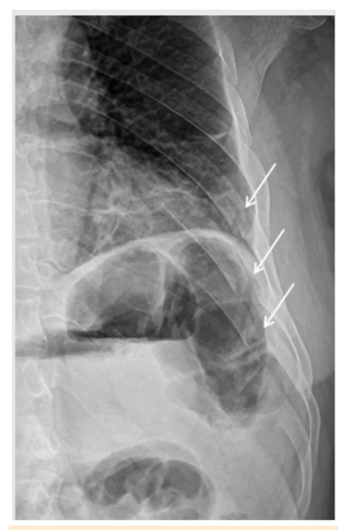
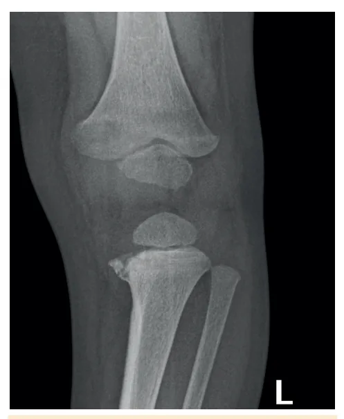
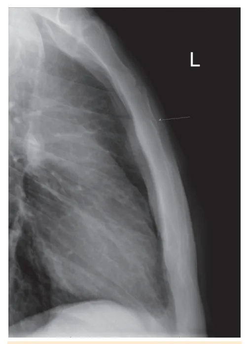
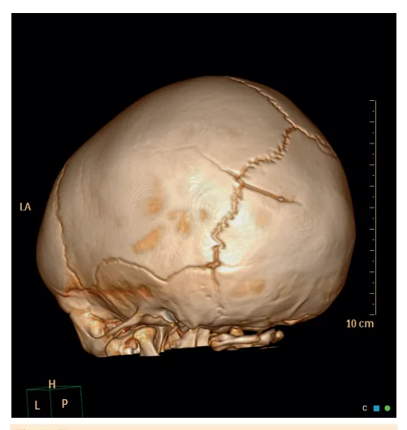

# Violência Contra a Criança e o Adolescente

<!-- page:1 -->

## VIOLÊNCIA CONTRA A CRIANÇA

## E O ADOLESCENTE

Maus Tratos e Violência SINAIS ESPECÍFICOS PARA VIOLÊNCIA FÍSICA investigação radiológica completa de esqueleto em

- Fraturas: lactentes. TC de crânio e fundo de olho (suspeita de Metafisárias por arrancamento ao nível da Shaken Baby) cartilagem de crescimento (em “alça de balde”

- Hospitalização: conforme gravidade do quadro ou “de canto”); diafisárias em espiral; clínico e na inexistência de outros recursos para a De arcos costais em menores de 2 anos ou de proteção contra novos episódios.

arcos posteriores;

- Notificação compulsória à suspeita! Conselho Crânio: diástase de suturas; que atravessam Tutelar (ou Ministério Público) e Sistema de suturas; múltiplas ou bilaterais; afundamento Informação de Agravos de Notificação (Sinan).

de crânio ou em bola de pingue-pongue Violência sexual aguda (RNs e lactentes).

- Coletar sorologias, ß-HCG (meninas em idade

SÍNDROME DO BEBÊ SACUDIDO (SHAKEN BABY fértil); hemograma, ureia, creatinina, TGO, TGP, SYNDROME) glicose, bilirrubinas total e frações; conteúdo vaginal

- Tríade encefalopatia, hematoma subdural e (pesquisa de Clamídia, Gonococo e Trichomonas, hemorragia de retina. cultura para gonococo e PCR para Chlamydia.

## SÍNDROME DE MUNCHAUSEN POR PROCURAÇÃO

- Avaliar necessidade de profilaxia contra tétano

- DESCONFIE SE:

- Profilaxias de ISTs não virais: penicilina benzatina

- Doenças/sintomas variados, recidivantes (sífilis), ceftriaxona (gonorreia), azitromicina ou multifacetados (clamídia), metronidazol (tricomoníase).

- Não responde aos tratamentos e não corresponde

- Hepatite B:

com os exames. | Vacina (se incompleto) 0, 1 e 6 meses após a

- Solicita sempre mais exames/ procedimentos/ violência sexual + imunoglobulina hiperimune tratamentos/ encaminhamentos para hepatite B em até, no máximo, 14 dias após

- Utiliza linguagem médica, procura reconhecimento a violência sexual (ideal: 48h) como bom cuidador

- Vacina HPV: se esquema vacinal incompleto

- HIV: tempo entre a exposição e o atendimento

CONDUTA FRENTE A VIOLÊNCIA CONTRA A de até 72h- Tenofovir/lamivudina (TDF/3TC) + CRIANÇA E O ADOLESCENTE: Dolutegravir (DTG) por 28 dias.

- Acolhimento interdisciplinar

- Contracepção de emergência: meninas na

- Exame físico completo; registro e documentação menacme com contato certo ou duvidoso com de lesões sêmen. Primeira escolha: levonorgestrel 1,5 mg

- Exames complementares: guiados pelas queixas; VO DU (ideal: < 72h)

## DEFINIÇÕES

| Síndrome de Munchausen por procuração | Química

- Define-se como violência contra a criança ou o | Infanticídio, filicídio, homicídio adolescente toda ação ou omissão, conscientemente

- Características dos pais de risco:

aplicada ou não, que venha a lhe provocar dor, seja ela | Apresentam depressão/ psicose puerperal ou física, psíquica e/ou sexual. outros transtornos mentais

- Pode ser classificada como intrafamiliar (doméstica), | Culpabilizam o filho por seus extrafamiliar ou autoinfligida (autoagressão). insucessos/ sofrimentos Quando é exercida por um responsável, permanente | Incapacidade/negação de seguir ou temporário, ou alguém que mantenha com orientações médicas a vítima um laço de parentesco, dependência, | Desinteresse no desenvolvimento da criança coabitação ou submissão, classifica-se como | Vítimas de violência na infância não tratada violência doméstica (ou intrafamiliar) e caracteriza- | Uso de substâncias psicoativas ou dependência química se o crime de maus-tratos. | Antecedentes criminais

- Violência intrafamiliar (maus tratos) - tipos:

- Características da criança ou adolescente de risco: Física | Não desejados ou não aceitos/ diferente das Psíquica expectativas dos pais Sexual | Histórico de grandes dificuldades na gravidez, parto Negligência ou omissão e/ou amamentação

---

<!-- page:2 -->

| Provenientes de estupro | Filhos de adolescentes sem suporte familiar | Filhos de relacionamentos conflituosos | Adotados ou sob guarda por abandono/ imposição legal | Filhos de outros relacionamentos colocados em novos arranjos familiares

## VIOLÊNCIA FÍSICA

## SINAIS GERAIS

- História de traumas frequentes

- Atraso para procura de atendimento

- História discordante entre os cuidadores

- Lesões incompatíveis com o mecanismo de trauma relatado, idade/desenvolvimento psicomotor da criança

- Lesões em locais incomuns, cobertos ou protegidos

- Estágios diferentes de cicatrização.

Figura 2: Fratura em “alça de balde” ou “de canto” Figura 1: A. Lesão na orelha por socos, semelhante à encontrada em boxeadores. B. Marcas de lesões infligidas por uma corda. C.

Contusões de diferentes estágios de cicatrização, infligidas em momentos diferentes. D. Hematomas na face.

## SINAIS ESPECÍFICOS

- Pele: lesões com formatos definidos, lesões em face, queimaduras.

- Fraturas de ossos longos: metafisárias por arrancamento ao nível da cartilagem de crescimento em espiral.

(em “alça de balde” ou “de canto”); diafisárias

- Fraturas de arcos costais: em menores de 2 anos ou de arcos posteriores. Fraturas de esterno (fratura ou luxação); da extremidade distal da clavícula e da escápula.

- Fraturas de crânio: diástase de suturas; múltiplas ou bilaterais; que atravessam suturas; afundamento de crânio ou em bola de pingue-pongue (recémnascidos e lactentes).

Figura 3: Fratura de arcos costais.

---

<!-- page:3 -->

cefálico, palidez com anemia, letargia, coma ou convulsões, apneia, bradicardia, alterações pupilares, parada cardiorrespiratória

- Tríade clássica: encefalopatia, hematoma subdural e hemorragia de retina.

Figura 4: Fratura de esterno. Figura 5: Fratura que atravessa a linha da sutura lambdoide. TRAUMATISMO CRANIOENCEFÁLICO ABUSIVO: SÍNDROME DO BEBÊ SACUDIDO (SHAKEN BABY SYNDROME)

- Sacudidas vigorosas em < 2 anos → aceleração, desaceleração, rotação → massa encefálica x calota craniana → contusão, rompimento, cisalhamento

- Pode não ter sinais externos de violência física

- Sinais e sintomas inespecíficos: irritabilidade, vômitos, fontanela anterior abaulada, aumento do perímetro hemorragia de retina.

Figura 6: Sinais altamente sugestivos da Síndrome do Bebê Sacudido

## VIOLÊNCIA PSICOLÓGICA OU

## PSÍQUICA

- Manifesta-se por: Desamparo Humilhação, desqualificação, tratamento como de menor valor Culpabilização Exigências de desempenho acima do possível e esperado pela idade e estímulo recebido Indiferença por sua saúde, proteção e desenvolvimento. Preconceito, discriminação, corrupção Abandono Atraso do desenvolvimento neuropsicomotor Irritabilidade, dificuldades de sono e/ou choro frequente Criança que não busca o olhar ou atenção do adulto Desinteresse em brincar/ lazer. Gagueira, disartria, dificuldade de expressão ou de socialização

SINAIS E SINTOMAS:

---

<!-- page:4 -->

## NEGLIGÊNCIA OU OMISSÃO DO

| Baixa autoestima e autoconfiança

## | Medo dirigido a certas pessoas CUIDAR

| Medo exacerbado de figuras imaginárias | Isolamento ou reclusão no meio virtual

- Sociocultural (culposa) ou intencional (dolosa) Comportamentos de regressão: infantilização, manutenção de dependência, enurese, encoprese Comportamentos obsessivos ou compulsivos Tiques ou manias Hipo ou hiperatividade Déficit/deslocamento de atenção Fracasso na aprendizagem Comportamentos de risco: envolvimento com drogas, desafios perigosos ou mortais na internet; delinquência Ausência de metas Autoagressão direta: distúrbios alimentares, recusa a tratamentos, ideação ou tentativa de suicídio.

## CONSEQUÊNCIAS: F

## VIOLÊNCIA SEXUAL

- SINAIS INDIRETOS: Demonstração de conhecimento ou prática de atos e atitudes sexuais inapropriadas para a idade Escolha de vestes, adornos ou maquiagens de P idades mais adiantadas, com aspecto sexualizado Aceleração da puberdade, sem outras causas que a determinem Masturbação compulsiva e sem controle social Sinais de sedução ou apaixonamento por pessoa próxima Normalização da violência Dificuldades de atenção e concentração Atraso de desenvolvimento neuropsicomotor Problemas de aprendizagem Edema, lacerações, equimoses, hematomas, marcas de mordidas, com maior frequência em mamas, parte interna de coxas, baixo abdome, períneo, região perianal Sangramento vaginal em pré-púberes, excluída a possibilidade de puberdade precoce e de presença de corpo estranho Rompimento himenal Sangramento ou fissuras anais, ou cicatrizes, sem justificativa orgânica, como obstipação crônica Hipotonia e dilatação de esfíncter anal, sem causa orgânica Selfies, nudes, pornografia infantil Grooming Sexting e sextorção Estupro virtual

## SINAIS DIRETOS E ALTAMENTE SIGNIFICATIVOS: VIOLÊNCIA SEXUAL NO MUNDO VIRTUAL: C

- FORMAS:

- Saúde: falta de higiene; doenças parasitárias/ infecciosas frequentes; irregularidade no acompanhamento; descaso/desinteresse; má nutrição.

- Desenvolvimento/educação: falta de estímulos;

não oferecimento de material escolar e ambiente de estudo; absenteísmo escolar.

- Proteção: vestimentas; drogas;

relacionamentos sexuais.

- Afetividade: desinteresse com a rotina/ locais que frequenta/companhias; ausência de demonstrações de carinho ou bem-querer;

desvalorização; preconceito.

- No uso do mundo virtual: uso excessivo pelos pais;

uso precoce pelos bebês; uso excessivo e não supervisionado pelas crianças e adolescentes.

- Rejeição

- Abandono.

## SÍNDROME DE MUNCHAUSEN POR

## PROCURAÇÃO

- Cuidador: exagera, mente e/ou simula achados físicos ou induz intencionalmente doença na criança.

- Criança: recebe cuidados médicos desnecessários e prejudiciais

- Desconfiar: Atendimento médico frequente Queixas de doenças variadas, ou mesmo de doença recidivante ou multifacetada A suposta doença não responde aos tratamentos indicados e não corresponde com os resultados de exames. Solicita sempre mais exames e procedimentos, mesmo os mais invasivos, novos tratamentos, encaminhamentos a outras especialidades Utiliza linguagem médica, procura reconhecimento como bom cuidador Sempre se mantêm muito próximos da criança ou adolescente, não aceitando deixá-los sozinhos com os profissionais da saúde Imposição de uma série de limitações à vítima: Cuidadores muito gentis na presença de outros e extremamente duros na imposição de suas condutas e supostos tratamentos à sua vítima.

alimentares, brincadeiras, relacionamentos

## CONDUTA

- Acolhimento

- Exame físico completo

- Registro e a documentação das lesões

---

<!-- page:5 -->

- Exames complementares

- Contracepção de emergência: meninas na menacme Investigação radiológica completa de esqueleto até com contato certo ou duvidoso com sêmen. Fundo de olho e Tomografia de crânio (lactentes | O mais precocemente possível, idealmente nas com suspeita de Síndrome do Bebê Sacudido). primeiras 72h após o abuso.

os 2 anos de idade | Primeira escolha: levonorgestrel VO. com suspeita de Síndrome do Bebê Sacudido).

- Hospitalização: Gravidade do quadro clínico Inexistência de recursos para a proteção contra novos episódios

- Deveres legais: notificar à suspeita! Conselho Tutelar (ou Ministério Público) e Sistema de Informação de Agravos de Notificação (Sinan).

Se houver risco emergencial de segurança ao paciente, o acionamento do Conselho Tutelar deve ser imediato.

| Boletim de ocorrência (BO): em situações de violência gravíssimas (p. ex., intoxicações intencionais, tentativas de envenenamento, lesões corporais graves, tentativas de filicídio ou abusos sexuais) deve-se também realizar registro por BO na delegacia de polícia especializada em delitos contra crianças e adolescentes (ou, na falta desta, na delegacia mais próxima). Se não houver condições práticas no momento desse registro, deverá ser comunicado por via telefônica à Polícia Militar local.

## VIOLÊNCIA SEXUAL AGUDA

- Coletar exames: Anti HIV; hepatite B (HbsAG e anti Hbs); hepatite C ß-HCG (meninas em idade fértil); Hemograma, ureia, creatinina, TGO, TGP, glicose, bilirrubinas total e frações. Conteúdo vaginal: exame bacterioscópico cultura para gonococo e PCR para Chlamydia.

(anti HCV); sífilis. (pesquisa de Clamídia, Gonococo e Trichomonas);

- Avaliar necessidade de profilaxia contra tétano

- Profilaxias de infecções sexualmente transmissíveis

(ISTs): Tabela 1

- Hepatite B: se contato com sêmen, sangue ou fluidos corporais. Vítima não imunizada ou com esquema vacinal incompleto: vacina 0, 1 e 6 meses após a violência sexual + imunoglobulina hiperimune para hepatite B em até, no máximo, 14 dias após a violência sexual, mas idealmente nas primeiras 48 horas.

- HIV: se contato com sangue, sêmen, fluidos vaginais, com exposição de mucosa ou pele não íntegra e tempo entre a exposição e o atendimento de até 72h. Feito com tenofovir/lamivudina (TDF/3TC) +

Dolutegravir (DTG) por 28 dias. primeiras 72h após o abuso.

- Vacina HPV: Realizar nas vítimas com esquema vacinal incompleto (meninos e meninas a partir de 9 anos).

Tabela 1: Profilaxia de IST virais frente à violência sexual aguda. Medicação < 45 kg > 45 kg 50 mil 2,4 UI/kg, IM, Penicilina G milhões UI, Sífilis dose única benzatina IM, dose (máximo 2,4 única milhões)

500 mg, 125 mg, IM, Gonorreia Ceftriaxona IM, dose dose única única 20 mg/kg peso, VO, 1 g VO Clamídia Azitromicina dose única dose única (máximo 1g)

15 mg/ kg/dia, divididos em 3 2 g VO Tricomoníase Metronidazol doses/dia, dose única por 7 dias (máximo 2 g)

## REFERÊNCIAS

Figura 1: A. Lesão na orelha por socos, semelhante à encontrada em boxeadores. B. Marcas de lesões infligidas por uma corda.

C. Contusões de diferentes estágios de cicatrização, infligidas em momentos diferentes. D. Hematomas na face.

Anesth Analg. 2016 Jun; 122(6): 1971–1982. Figura 2: Fratura em “alça de balde” ou “de canto”. Hani M. Al Salam, Radiopaedia.org, rID: 13614 Figura 3: Fratura de arcos costais.

Dalia Ibrahim, Radiopaedia.org, rID: 30339 Figura 4: Fratura de esterno. Jayanth Keshavamurthy, Radiopaedia.org, rID: 38447 Figura 5: Fratura que atravessa a linha da sutura lambdoide.

Chris O’Donnell, Radiopaedia.org, rID: 17372 Figura 6: Sinais altamente sugestivos da Síndrome do Bebê Sacudido Banco de ilustrações - Medcof.

Tabela 1: Profilaxia de IST virais frente à violência sexual aguda. Adaptada de BRASIL. Ministério da Saúde. Orientações aos profissionais da saúde em situações de emergências em saúde pública: violência sexual. Brasília, 2016. Disponível em: https://www.gov.br/saude/pt-br/ centrais-de-conteudo/publicacoes/svsa/emergencia-em-saudepublica/orientacoes-aos-profissionais-da-saude-em-situacoes-deemergencias-em-saude-publica-violencia-sexual-tamanho-a4. Acesso em: 24 mar. 2025.
