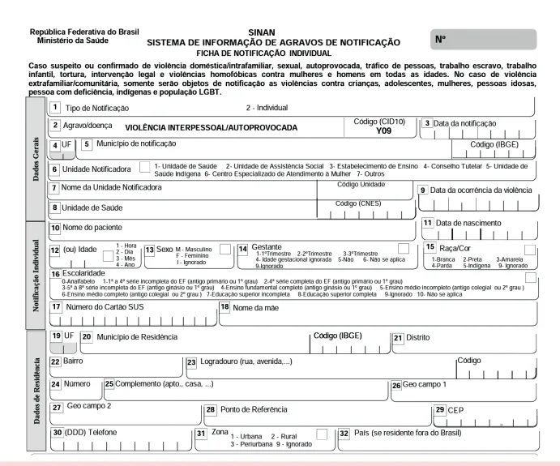

# Violência Sexual

<!-- page:1 -->

Anticoncepção - situações especiais

- **Notificação compulsória**: todo caso de suspeita ou confirmação de violência contra a mulher;
- O atendimento inicial às vítimas de violência sexual é uma **emergência**! Realizar em até **72 horas** da agressão para garantir a eficácia das medidas contraceptivas e das profilaxias.
- **Etapas do atendimento**: acolhimento, notificação, anamnese com exame físico e coleta de vestígios, exames complementares, profilaxias, contracepção de emergência e seguimento ambulatorial.

> ⚠️ Trecho reconstruído a partir de OCR — confira contra a fonte original.

### Profilaxias (resumo)

- **Tétano** → vacinar se: história vacinal incerta ou < 3 doses; ou 3 doses completas sendo a última entre 5 e 10 anos + ferimento profundo/sujo; ou 3 doses completas sendo a última há mais de 10 anos. Fazer imunoglobulina ou soro antitetânico se vacinação incerta ou com menos de 3 doses diante de ferimento não leve/não superficial.
- **ISTs não virais**:
  - **Sífilis** → Penicilina G benzatina 2,4 milhões UI, IM (1,2 milhão UI em cada glúteo), dose única; crianças: 50 mil UI/kg, IM, dose única (dose máxima total: 2,4 milhões UI);
  - **Gonorreia** → Ceftriaxona 500 mg, 1 ampola, IM, dose única; crianças: 125 mg, IM, dose única;
  - **Clamídia** → Azitromicina 500 mg, 2 comprimidos, VO, dose única (1 g); crianças: 20 mg/kg, VO, dose única (máximo total 1 g);
  - **Tricomoníase** → Metronidazol 500 mg, 4 comprimidos, VO, dose única (dose total 2 g); crianças: 15 mg/kg/dia, divididos em 3 doses/dia, por 7 dias (dose diária máxima 2 g).
- **Hepatite B** — indicada se contato com sêmen, sangue ou fluidos corporais, em não imunizadas ou com esquema vacinal incompleto: vacina anti-HepB IM em deltoide (0, 1 e 6 meses) + imunoglobulina hiperimune para hepatite B (IGHAHB), até no máximo 14 dias após a violência sexual, mas idealmente nas primeiras 48 horas.
- **HIV** — não é recomendada a profilaxia se: penetração oral sem ejaculação; uso de preservativo durante toda a agressão sexual; agressor sabidamente HIV negativo; abuso sexual sofrido há mais de 72 horas; ou abuso crônico pelo mesmo agressor. Esquema: Tenofovir/lamivudina (TDF/3TC) + Dolutegravir (DTG) por 28 dias.
- **Contracepção de emergência** — idealmente até 72h após o evento:
  - Levonorgestrel 1,5 mg, via oral, dose única (primeira escolha);
  - Método de Yuzpe → AHOC com 0,05 mg de etinilestradiol e 0,25 mg de levonorgestrel por comprimido, 2 cp a cada 12 horas (total de 4 cps); ou AHOC com 0,03 mg de etinilestradiol e 0,15 mg de levonorgestrel por comprimido, 4 cp a cada 12 horas (total de 8 cps);
  - DIU de cobre → inserir até 5 dias após a relação sexual (não é recomendado após violência sexual, porque a inserção do DIU pode ser dolorosa, o que pode ser traumatizante para a vítima).

## Violência Contra a Mulher

- De acordo com a Organização Mundial da Saúde, em 2017, **1 em cada 3 mulheres** sofre violência (física ou sexual) no mundo;
- Definimos violência contra a mulher como qualquer ato ou conduta baseada no gênero, que causa dano, morte, sofrimento físico, psicológico ou sexual à mulher, em esfera pública ou privada;
- O ambiente da violência é geralmente o doméstico;
- Fatores econômicos, sociais e culturais muitas vezes estão envolvidos, o que perpetua a impunidade e a invisibilidade dos casos;
- Em cerca de **70%** dos casos de violência, os agressores são pessoas com quem a vítima mantém ou manteve vínculo afetivo;
- Central de atendimento à mulher → **Disque 180**.

## Aspectos Éticos e Legais

**Lei nº 11.340 (2006) → Lei Maria da Penha**:

- Garante acesso à assistência social, saúde, suporte jurídico, perícia e proteção à vítima — contra violência sexual, física, patrimonial, moral e psicológica.

**Lei nº 12.015 (2009)**:

- Define estupro como o ato de "constranger alguém, mediante violência ou grave ameaça, a ter conjunção carnal ou a praticar ou permitir que com ele se pratique outro ato libidinoso".
- **Conjunção carnal**: penetração pênis-vagina;
- **Ato libidinoso**: penetração oral ou anal;
- **Estupro de Vulnerável**: "ter conjunção carnal ou praticar outro ato libidinoso com menor de 14 anos".

- É de **notificação compulsória** todo caso de suspeita ou confirmação de violência contra a mulher (Lei nº 10.778 — 2003 — e Lei nº 13.931 — 2019);
- Em todo o território nacional (Lei nº 10.778);
- Qualquer caso de suspeita ou confirmação de violência:

---

<!-- page:2 -->

- **Crianças e adolescentes < 18 anos de idade**: comunicar Conselho Tutelar ou a Vara da Infância e da Juventude;
- **Idosas**: comunicar autoridade policial, Ministério Público, Conselho Municipal ou Estadual ou Nacional do Idoso.

## Atendimento Inicial

- É uma **emergência**! Realizar em até 72 horas da agressão para garantir a eficácia das medidas contraceptivas e das profilaxias.
- Atentar para o registro completo e detalhado das informações preliminares em prontuário médico, para que o paciente não necessite repetir várias vezes os fatos ocorridos.
- É feita a comunicação do caso para a delegacia de referência, para que sejam realizados os exames periciais.

**Etapas do atendimento**:

- Acolhimento;
- Notificação;
- Anamnese, exame físico, coleta de vestígios;
- Exames complementares;
- Profilaxias;
- Contracepção de emergência;
- Seguimento ambulatorial.

- Fundamental garantir a ética e comunicar que é um ambiente de privacidade, confidencialidade e sigilo;
- O atendimento é multiprofissional, com participação do enfermeiro, assistente social e psicólogo.

Figura 1: Acolhimento às vítimas de violência sexual — elementos avaliados: ambiente reservado, tempo decorrido, uso de preservativo, tipo de agressão, contracepção.

- Antes mesmo do atendimento médico, na etapa de acolhimento podem ser obtidas algumas informações preliminares, como: tempo decorrido da violência; se houve uso de preservativo ou não no momento da violência; o tipo de agressão sofrida; se a paciente realiza ou não método contraceptivo eficaz.

### Perícia

- Para a realização da perícia, faz-se necessária a nomeação de um médico específico para isso, que pode ser o próprio médico legista do Instituto Médico Legal (IML) do município ou mesmo um **perito ad hoc**, isto é, um perito não oficial, cidadão comum, que presta o compromisso de desempenhar este cargo, tendo sido nomeado pelo juiz criminal, promotor de justiça ou delegado de polícia para tal.
- No Brasil, formalmente o médico que irá realizar os exames periciais não pode ser o médico assistente da paciente no pronto atendimento. No entanto, em diversas situações, é desejável que o serviço de saúde proceda com o recolhimento de elementos que, eventualmente, colaborem com necessidades das autoridades ou que auxiliem na confecção de laudo indireto de Exame de Corpo de Delito e Conjunção Carnal.

### Notificação

- Notificação compulsória de todo caso suspeito ou confirmado;
- Notificação imediata (em até 24 horas) para a Secretaria Municipal de Saúde;
- Preenchimento: realizado pela equipe de saúde envolvida no atendimento de emergência.

## Anamnese

**Como detalhar melhor a história**:

- Ouvir, evitar fazer muitas perguntas ou interromper a fala da paciente;
- Transmitir segurança e garantir a confidencialidade da consulta;
- Questionar sobre seus sentimentos no momento (medo, angústia, tristeza);
- Perguntar ativamente sobre a existência da violência;
- Atenção aos detalhes;
- Criar vínculo.

**Tópicos que devem ser idealmente abordados no primeiro atendimento**:

- Local, dia e hora da violência sexual e do atendimento médico;
- História clínica detalhada;
- Tipo(s) de violência sexual sofrida(s);
- Forma(s) de constrangimento empregada(s);
- Tipificação e número de agressores;
- Exame físico completo — descrição minuciosa das lesões;
- Descrição minuciosa de vestígios e de outros achados no exame;
- Identificação dos profissionais que atenderam a vítima, com letra legível e assinatura;
- Preenchimento da Ficha de Notificação Compulsória.

---

<!-- page:3 -->

Figura 2: Exemplo de ficha de notificação compulsória, para preenchimento diante de todo caso suspeito ou confirmado de violência contra a mulher.

## Exame Físico

- Registro do exame físico completo;
- Pedir autorização e explicar à paciente sobre o que será realizado, quais locais do corpo serão tocados, quais exames serão coletados;
- Descrever as lesões (sentido craniocaudal): localização, tamanho, número e forma (lesões genitais e extragenitais).

> ⚠️ Tabela reconstruída a partir de OCR — confira contra a fonte original.

**Tabela 1: Diferentes regiões do corpo para avaliação durante o exame físico, e as possíveis lesões encontradas**

| Região | Possível lesão |
|---|---|
| Couro cabeludo | Equimose, escoriação, edema traumático. |
| Face | Fratura (malar, nasal), marcas de mordida, escoriação, equimose facial e edema traumático. |
| Olhos e orelhas | Equimose periorbitária, escoriação. |
| Boca | Equimose labial, escoriação, marca de mordida. |
| Torácica e abdominal | Equimose, corpos estranhos presentes na pele. |
| Mamária | Marcas de mordida ou sucção. |
| Membros superiores | Equimose, escoriação. |
| Mãos | Fratura, edema traumático. |
| Membros inferiores | Equimose especialmente em faces mediais das coxas; lesões de defesa; escoriação. |
| Genital | Edema traumático, rotura himenal. |
| Anal | Equimose, laceração, dilatação. |

### Coleta de Vestígios (Exames Forenses)

- No Brasil: procedimento formalmente atribuído aos peritos do Instituto Médico Legal;
- Em casos específicos, outros profissionais legalmente investidos para esse fim;
- Assinar o termo de autorização de coleta e utilização de material biológico;
- Coletar o material biológico dentro de 72 horas após a agressão;
- Se a pessoa em situação de violência decidir pelo registro policial, as informações e o material serão encaminhados à autoridade policial.

## Exames Complementares

A coleta de exames não deve retardar o início da profilaxia.

- **Conteúdo vaginal**: exame bacterioscópico (pesquisa de Gonococo e *Trichomonas*), cultura para gonococo e PCR para Clamídia.
- **Sangue**: Anti-HIV, Hepatite B (HbsAg e anti-HBs), Hepatite C (anti-HCV), Sífilis, β-HCG (para mulheres em idade fértil), hemograma, ureia, creatinina, TGO, TGP, glicose, bilirrubinas total e frações.

Figura 3: À esquerda: gonococo. À direita: *Trichomonas*.

---

<!-- page:4 -->

> ⚠️ Tabela reconstruída a partir de OCR — confira contra a fonte original.

**Tabela 2: Seguimento dos exames laboratoriais — Ministério da Saúde**

| Exame | Admissão | 2 semanas | 6 semanas | 3 meses | 6 meses |
|---|---|---|---|---|---|
| Conteúdo vaginal | Sim | — | — | — | — |
| Sífilis | Sim | — | — | Repetir | Repetir |
| Anti-HIV | Sim | — | — | Repetir | Repetir |
| Hepatite B (HbsAg) | Sim | — | — | Repetir | Repetir |
| Hepatite C | Sim | — | — | Repetir | Repetir |
| Hemograma, glicose, ureia, creatinina, TGO, TGP, bilirrubinas diretas e indiretas | Sim | Se uso profilático de medicação antirretroviral | Se uso profilático de medicação antirretroviral | — | — |
| Beta-HCG | Sim | — | — | — | — |

Obs.: poderá ser realizado nas unidades de atenção primária de saúde.

## Profilaxias

### Tétano

- Como decidir pela vacinação contra tétano? Avaliar o status vacinal da paciente e avaliar o tipo de ferimento sofrido (traumas físicos; contaminação com poeira ou terra).

> ⚠️ Tabela reconstruída a partir de OCR — confira contra a fonte original.

**Tabela 3: Orientação para vacinação contra tétano**

| História vacinal | Ferimento limpo ou superficial | Outro tipo de ferimento |
|---|---|---|
| Incerta ou menos de 3 doses | Vacinar | Vacinar |
| 3 doses completas, última há < 5 anos | Não vacinar | Não vacinar |
| 3 doses completas, última entre 5 e 10 anos | Não vacinar | Vacinar |
| 3 doses completas, última há mais de 10 anos | Vacinar | Vacinar |

- Quando usar o soro antitetânico ou a imunoglobulina humana? Se vacinação incerta ou com menos de 3 doses diante de ferimento não leve/não superficial.
- **Dose**: Imunoglobulina humana antitetânica 5.000 UI por via intramuscular.

### ISTs Não Virais

- Avaliar o risco de infecção: tipo de material biológico envolvido; tipo de prática sofrida; número de agressores; tempo de exposição; condição himenal (íntegro ou com rotura, cicatrizada ou recente, única ou múltiplas); presença de traumatismos genitais; idade; suscetibilidade; lesões prévias em mucosas; presença de ISTs.
- **Alternativas**: Sífilis: eritromicina 500 mg 6/6 horas por 15 dias; Gonorreia: ciprofloxacino (contraindicado para crianças e gestantes).
- \* Se for necessário escolher uma profilaxia para adiar, prefira o metronidazol.

### Hepatite B

- Quando realizar? Contato com sêmen, sangue ou fluidos corporais; não imunizadas ou esquema vacinal incompleto: administrar vacina para HBV + imunoglobulina hiperimune para hepatite B.
- Quando não realizar? Imunizadas, agressor sabidamente vacinado, ou ausência de contato com fluidos ou uso de preservativo durante todo o ato de violência sexual.
- Quando desconsiderar esta profilaxia? Situações de abuso crônico; uso de preservativo durante todo o crime sexual.

---

<!-- page:5 -->

> ⚠️ Tabela reconstruída a partir de OCR — confira contra a fonte original.

**Tabela 4: Profilaxias das ISTs não virais**

| IST | Medicação | Posologia adultos > 45 kg | Posologia crianças < 45 kg |
|---|---|---|---|
| Sífilis | Penicilina G benzatina | 2,4 milhões UI, IM (1,2 milhão UI em cada glúteo), dose única | 50 mil UI/kg, IM, dose única (dose máxima total: 2,4 milhões UI) |
| Gonorreia | Ceftriaxona | 500 mg, 1 ampola, IM, dose única | 125 mg, IM, dose única (máximo total 1 g) |
| Clamídia | Azitromicina | 500 mg, 2 comprimidos, VO, dose única (1 g) | 20 mg/kg peso, VO, dose única (máximo total 1 g) |
| Tricomoníase | Metronidazol | 500 mg, 4 comprimidos, VO, dose única (dose total 2 g) | 15 mg/kg/dia, divididos em 3 doses/dia, por 7 dias (dose diária máxima 2 g) |

- Como realizar (Hepatite B)? Vacina anti-HepB: IM em deltoide — 0, 1 e 6 meses após a violência sexual; IGHAHB até, no máximo, 14 dias após a violência sexual, mas idealmente nas primeiras 48 horas; gestantes podem receber vacina ou IG independente da semana gestacional + lembrar de realizar profilaxia contra hepatite B para o RN nas primeiras 12-24h de vida.

### HIV

- **Critérios para profilaxia pós-exposição (TARV)**: contato com material biológico (sangue, sêmen, fluidos vaginais); tipo de exposição (mucosa, pele não íntegra); tempo entre a exposição e o atendimento de até 72h. Esquema: Tenofovir/lamivudina (TDF/3TC) + Dolutegravir (DTG) por 28 dias.
- **Critérios que não recomendam a profilaxia pós-exposição (TARV)**: penetração oral sem ejaculação; uso de preservativo durante toda a agressão sexual; agressor sabidamente HIV negativo; abuso sexual sofrido há mais de 72 horas; abuso crônico pelo mesmo agressor.

> ⚠️ Tabela reconstruída a partir de OCR — confira contra a fonte original.

**Tabela 5: Opções para contracepção de emergência**

| Método | Dose | Via | Observação |
|---|---|---|---|
| Levonorgestrel (primeira escolha) | 1,5 mg de levonorgestrel por comprimido | Oral | 1 cp → dose única (ou 0,75 mg por comprimido, 2 cp → dose única) |
| Método de Yuzpe (segunda escolha) | AHOC com 0,05 mg de etinilestradiol e 0,25 mg de levonorgestrel por comprimido | Oral | 2 cp a cada 12 horas → total de 4 cps |
| Método de Yuzpe (segunda escolha) | AHOC com 0,03 mg de etinilestradiol e 0,15 mg de levonorgestrel por comprimido | Oral | 4 cp a cada 12 horas → total de 8 cps |

## Contracepção de Emergência

O mais precocemente possível, idealmente nas primeiras 72h após o abuso. Pode-se considerar realizar até 5 dias após.

- **Indicações**: mulheres na menacme com contato certo ou duvidoso com sêmen, independente do período do ciclo menstrual em que se encontrem.
- **Contraindicações**: uso prévio de método contraceptivo de elevada eficácia (mas, na prática, sempre é oferecido).

### DIU de Cobre

- Inserir até 5 dias após a relação sexual desprotegida (Febrasgo);
- O DIU de cobre não é recomendado como contraceptivo de emergência após violência sexual (CDC): a inserção do DIU pode ser dolorosa, o que pode ser traumatizante para a vítima.

## Seguimento

- **1º retorno**: em 7 a 14 dias: checar os exames colhidos e o uso das medicações antirretrovirais; avaliar efeitos colaterais e adesão às medicações.
- Retornos sequenciais para avaliação sorológica em 3 e 6 meses.

---

<!-- page:6 -->

## Atualizações

### Vacina HPV e Violência Sexual

**Nota Técnica nº 63/2023 do Ministério da Saúde**:

- Inclusão das vítimas de violência sexual, mulheres e homens, de 9 a 45 anos de idade, que ainda não tomaram a vacina, como grupo-alvo da vacina HPV;
- A oferta da vacina será incluída no protocolo de atendimento existente às vítimas de violência sexual;
- Ressalta-se que as pessoas previamente vacinadas (esquema completo) não necessitarão de doses suplementares;
- Aquelas com esquema incompleto deverão receber as doses necessárias para completar seu esquema vacinal.

## Referências

Figura 1: Acolhimento às vítimas de violência sexual. Acervo de imagens Medcof.

Figura 2: Exemplo de ficha de notificação compulsória para preenchimento diante de todo caso suspeito ou confirmado de violência contra a mulher. MINISTÉRIO DA SAÚDE. Violência interpessoal/autoprovocada. 2016. Disponível em: https://portalsinan.saude.gov.br/violencia-interpessoal-autoprovocada.

Figura 3: À esquerda: gonococo. À direita: tricomonas. CDC; JACOBS, Dr. Norman. *Neisseria gonorrhoeae*. Identificação #3693. De Centers for Disease Control and Prevention's Public Health Image Library (PHIL). Disponível em: https://phil.cdc.gov/Details.aspx?pid=3693.

Tabela 1: Diferentes regiões do corpo para avaliação durante o exame físico, e as possíveis lesões encontradas.

Tabela 2: Seguimento dos exames laboratoriais — Ministério da Saúde. Baseado em: MINISTÉRIO DA SAÚDE. Prevenção e tratamento dos agravos resultantes da violência sexual contra mulheres e adolescentes: norma técnica. Brasília: Ministério da Saúde, 2012.

Tabela 4: Profilaxias das ISTs não virais. Adaptado de: MINISTÉRIO DA SAÚDE. Protocolo clínico e diretrizes terapêuticas para profilaxia antirretroviral pós-exposição de risco à infecção pelo HIV: versão para divulgação. Brasília: Ministério da Saúde, 2015.
